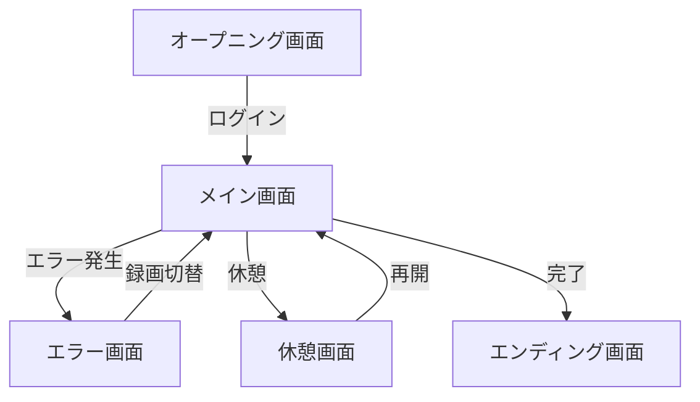

# AltMX UI/UXデザイン仕様書

## 📌 ドキュメント概要

**プロジェクト名**: AltMX - AI協働開発ライブデモンストレーションシステム  
**バージョン**: 1.0.0  
**作成日**: 2025年  
**デザインコンセプト**: Vaporwave × Retro Pixel Design  

---

## 🎨 デザインコンセプト

### ビジュアルアイデンティティ
- **メインテーマ**: 80-90年代レトロコンピューター × ヴェイパーウェイブ
- **カラーパレット**:
  - Primary: `#00ffff` (シアン)、`#ff71ce` (ピンク)
  - Secondary: `#ffd700` (ゴールド)、`#ffb000` (オレンジ)
  - Accent: `#f093fb` (紫)、`#00ff41` (グリーン)
  - Base: `#000000` (黒)、`#ffffff` (白)

### デザイン原則
1. **ノスタルジー**: Windows 95やファミコンRPGを彷彿とさせる懐かしさ
2. **近未来感**: ネオングロー、グリッチエフェクトによる未来的演出
3. **親しみやすさ**: 北海道弁を話すAIキャラクターによる心理的距離の短縮
4. **エンターテインメント性**: ゲーム要素による技術デモの娯楽化

---

## 🖼️ 画面構成

### 1. オープニング画面（システム起動）

#### 概要
ライブパフォーマンスの開始時に表示される起動画面。期待感を高める演出を重視。

#### 主要機能
- プレゼンターログイン
- セッションコード入力（オプション）
- システム起動アニメーション
- ブートシーケンス表示

#### ビジュアル要素
- グラデーション背景（時間変化）
- グリッドラインアニメーション
- パーティクルエフェクト
- ネオングロー効果

#### コード実装
```html
<!DOCTYPE html>
<html lang="ja">
<head>
    <meta charset="UTF-8">
    <meta name="viewport" content="width=device-width, initial-scale=1.0">
    <title>AltMX System Boot</title>
    <style>
        @import url('https://fonts.googleapis.com/css2?family=VT323&family=Orbitron:wght@400;900&display=swap');
        
        * {
            margin: 0;
            padding: 0;
            box-sizing: border-box;
        }
        
        body {
            font-family: 'VT323', monospace;
            background: #000;
            color: #fff;
            height: 100vh;
            overflow: hidden;
            position: relative;
        }
        
        /* 背景アニメーション */
        .bg-container {
            position: fixed;
            top: 0;
            left: 0;
            width: 100%;
            height: 100%;
            background: linear-gradient(135deg, #667eea 0%, #764ba2 100%);
            animation: gradient-shift 10s ease infinite;
        }
        
        @keyframes gradient-shift {
            0%, 100% { background: linear-gradient(135deg, #667eea 0%, #764ba2 100%); }
            25% { background: linear-gradient(135deg, #f093fb 0%, #f5576c 100%); }
            50% { background: linear-gradient(135deg, #4facfe 0%, #00f2fe 100%); }
            75% { background: linear-gradient(135deg, #43e97b 0%, #38f9d7 100%); }
        }
        
        /* グリッドライン */
        .grid-overlay {
            position: fixed;
            top: 0;
            left: 0;
            width: 100%;
            height: 100%;
            background-image: 
                repeating-linear-gradient(0deg, 
                    transparent, 
                    transparent 40px, 
                    rgba(255, 255, 255, 0.03) 40px, 
                    rgba(255, 255, 255, 0.03) 41px),
                repeating-linear-gradient(90deg, 
                    transparent, 
                    transparent 40px, 
                    rgba(255, 255, 255, 0.03) 40px, 
                    rgba(255, 255, 255, 0.03) 41px);
            pointer-events: none;
            animation: grid-move 20s linear infinite;
        }
        
        @keyframes grid-move {
            0% { transform: translate(0, 0); }
            100% { transform: translate(40px, 40px); }
        }
        
        /* スキャンライン */
        .scanlines {
            position: fixed;
            top: 0;
            left: 0;
            width: 100%;
            height: 100%;
            background: repeating-linear-gradient(
                0deg,
                transparent,
                transparent 2px,
                rgba(255, 255, 255, 0.03) 2px,
                rgba(255, 255, 255, 0.03) 4px
            );
            pointer-events: none;
            z-index: 2;
        }
        
        /* ブート画面コンテナ */
        .boot-container {
            position: relative;
            z-index: 10;
            width: 100%;
            height: 100vh;
            display: flex;
            align-items: center;
            justify-content: center;
            animation: fade-in 1s ease-out;
        }
        
        @keyframes fade-in {
            from { opacity: 0; }
            to { opacity: 1; }
        }
        
        /* ブートシーケンス */
        .boot-sequence {
            display: none;
            position: absolute;
            top: 20px;
            left: 20px;
            font-size: 14px;
            color: #00ffff;
            text-shadow: 0 0 5px #00ffff;
            font-family: 'Courier New', monospace;
            line-height: 1.6;
        }
        
        .boot-sequence.active {
            display: block;
        }
        
        .boot-line {
            opacity: 0;
            animation: type-in 0.1s forwards;
        }
        
        @keyframes type-in {
            to { opacity: 1; }
        }
        
        /* メインロゴエリア */
        .main-content {
            text-align: center;
            padding: 40px;
            background: rgba(0, 0, 0, 0.8);
            border: 2px solid #00ffff;
            box-shadow: 
                0 0 50px rgba(0, 255, 255, 0.5),
                inset 0 0 50px rgba(0, 255, 255, 0.1);
            position: relative;
            max-width: 600px;
            width: 90%;
        }
        
        .main-content::before {
            content: "";
            position: absolute;
            top: -2px;
            left: -2px;
            right: -2px;
            bottom: -2px;
            background: linear-gradient(45deg, #ff006e, #8338ec, #3a86ff, #00ffff);
            z-index: -1;
            filter: blur(20px);
            opacity: 0.7;
            animation: border-glow 3s ease-in-out infinite;
        }
        
        @keyframes border-glow {
            0%, 100% { opacity: 0.5; }
            50% { opacity: 1; }
        }
        
        /* ロゴ */
        .logo-container {
            margin-bottom: 30px;
            position: relative;
        }
        
        .logo-main {
            font-family: 'Orbitron', monospace;
            font-size: 72px;
            font-weight: 900;
            background: linear-gradient(45deg, #00ffff, #ff71ce);
            -webkit-background-clip: text;
            -webkit-text-fill-color: transparent;
            background-clip: text;
            text-shadow: 0 0 80px rgba(0, 255, 255, 0.5);
            letter-spacing: 8px;
            animation: logo-pulse 2s ease-in-out infinite;
        }
        
        @keyframes logo-pulse {
            0%, 100% { transform: scale(1); }
            50% { transform: scale(1.05); }
        }
        
        .logo-sub {
            font-size: 20px;
            color: #ff71ce;
            margin-top: 10px;
            letter-spacing: 4px;
            text-transform: uppercase;
            animation: flicker 3s infinite;
        }
        
        @keyframes flicker {
            0%, 100% { opacity: 1; }
            50% { opacity: 0.8; }
        }
        
        .logo-version {
            position: absolute;
            top: -10px;
            right: -30px;
            background: #ff006e;
            color: #fff;
            padding: 4px 8px;
            font-size: 12px;
            transform: rotate(12deg);
            box-shadow: 0 0 10px rgba(255, 0, 110, 0.8);
        }
        
        /* ログインフォーム */
        .login-form {
            margin-top: 40px;
            opacity: 0;
            animation: slide-up 1s ease-out 1s forwards;
        }
        
        @keyframes slide-up {
            from {
                opacity: 0;
                transform: translateY(20px);
            }
            to {
                opacity: 1;
                transform: translateY(0);
            }
        }
        
        .input-group {
            margin-bottom: 20px;
            position: relative;
        }
        
        .input-field {
            width: 100%;
            padding: 15px 20px;
            background: rgba(0, 0, 0, 0.5);
            border: 2px solid #00ffff;
            color: #00ffff;
            font-family: 'VT323', monospace;
            font-size: 18px;
            outline: none;
            transition: all 0.3s;
        }
        
        .input-field::placeholder {
            color: rgba(0, 255, 255, 0.5);
        }
        
        .input-field:focus {
            background: rgba(0, 255, 255, 0.1);
            box-shadow: 0 0 20px rgba(0, 255, 255, 0.5);
        }
        
        .input-label {
            position: absolute;
            top: -10px;
            left: 15px;
            background: #000;
            padding: 0 5px;
            color: #ff71ce;
            font-size: 14px;
            text-transform: uppercase;
        }
        
        /* スタートボタン */
        .start-button {
            width: 100%;
            padding: 20px;
            margin-top: 30px;
            background: linear-gradient(45deg, #f093fb, #f5576c);
            border: none;
            color: #fff;
            font-family: 'Orbitron', monospace;
            font-size: 24px;
            font-weight: 700;
            cursor: pointer;
            text-transform: uppercase;
            letter-spacing: 2px;
            position: relative;
            overflow: hidden;
            transition: all 0.3s;
        }
        
        .start-button::before {
            content: "";
            position: absolute;
            top: 50%;
            left: 50%;
            width: 0;
            height: 0;
            background: rgba(255, 255, 255, 0.5);
            border-radius: 50%;
            transform: translate(-50%, -50%);
            transition: width 0.6s, height 0.6s;
        }
        
        .start-button:hover {
            transform: scale(1.05);
            box-shadow: 0 0 40px rgba(240, 147, 251, 0.8);
        }
        
        .start-button:active::before {
            width: 500px;
            height: 500px;
        }
        
        /* ステータスインジケーター */
        .status-container {
            margin-top: 30px;
            display: flex;
            justify-content: space-around;
            opacity: 0;
            animation: fade-in 1s ease-out 2s forwards;
        }
        
        .status-item {
            text-align: center;
        }
        
        .status-dot {
            display: inline-block;
            width: 12px;
            height: 12px;
            border-radius: 50%;
            margin-right: 8px;
            animation: blink 2s infinite;
        }
        
        .status-dot.online {
            background: #00ff41;
            box-shadow: 0 0 10px #00ff41;
        }
        
        .status-dot.connecting {
            background: #ffb000;
            box-shadow: 0 0 10px #ffb000;
        }
        
        @keyframes blink {
            0%, 100% { opacity: 1; }
            50% { opacity: 0.5; }
        }
        
        /* ローディング画面 */
        .loading-screen {
            display: none;
            position: fixed;
            top: 0;
            left: 0;
            width: 100%;
            height: 100%;
            background: #000;
            z-index: 1000;
            align-items: center;
            justify-content: center;
            flex-direction: column;
        }
        
        .loading-screen.active {
            display: flex;
        }
        
        .loading-logo {
            font-family: 'Orbitron', monospace;
            font-size: 48px;
            color: #00ffff;
            margin-bottom: 30px;
            animation: glitch 2s infinite;
        }
        
        @keyframes glitch {
            0%, 100% {
                text-shadow: 
                    2px 0 #ff00ff,
                    -2px 0 #00ffff;
            }
            50% {
                text-shadow: 
                    -2px 0 #ff00ff,
                    2px 0 #00ffff;
            }
        }
        
        .loading-bar {
            width: 300px;
            height: 30px;
            background: rgba(0, 0, 0, 0.5);
            border: 2px solid #00ffff;
            position: relative;
            overflow: hidden;
        }
        
        .loading-progress {
            height: 100%;
            background: linear-gradient(90deg, #00ffff, #ff71ce);
            width: 0%;
            transition: width 0.3s;
            box-shadow: 0 0 20px rgba(0, 255, 255, 0.8);
        }
        
        .loading-text {
            margin-top: 20px;
            color: #ff71ce;
            font-size: 18px;
        }
        
        /* パーティクル効果 */
        .particle {
            position: fixed;
            pointer-events: none;
            opacity: 0;
            animation: float-up 4s linear infinite;
        }
        
        @keyframes float-up {
            0% {
                opacity: 0;
                transform: translateY(100vh) scale(0);
            }
            10% {
                opacity: 1;
            }
            90% {
                opacity: 1;
            }
            100% {
                opacity: 0;
                transform: translateY(-100vh) scale(1);
            }
        }
        
        /* モバイル対応 */
        @media (max-width: 768px) {
            .logo-main {
                font-size: 48px;
            }
            
            .main-content {
                padding: 30px 20px;
            }
            
            .start-button {
                font-size: 20px;
            }
        }
    </style>
</head>
<body>
    <!-- 背景 -->
    <div class="bg-container"></div>
    <div class="grid-overlay"></div>
    <div class="scanlines"></div>
    
    <!-- ブートシーケンス（オプション） -->
    <div class="boot-sequence" id="bootSequence">
        <div class="boot-line">ALTMX SYSTEM v2.0.1</div>
        <div class="boot-line">Copyright (c) 2024 Your Company DX Team</div>
        <div class="boot-line">-----------------------------------------</div>
        <div class="boot-line">Initializing AI Core... [OK]</div>
        <div class="boot-line">Loading Neural Networks... [OK]</div>
        <div class="boot-line">Connecting to Claude API... [OK]</div>
        <div class="boot-line">WebSocket Server... [OK]</div>
        <div class="boot-line">Voice Recognition... [OK]</div>
        <div class="boot-line">-----------------------------------------</div>
        <div class="boot-line">System Ready.</div>
    </div>
    
    <!-- メインコンテンツ -->
    <div class="boot-container">
        <div class="main-content">
            <div class="logo-container">
                <div class="logo-version">v2.0</div>
                <div class="logo-main">AltMX</div>
                <div class="logo-sub">AI Collaboration System</div>
            </div>
            
            <div class="login-form">
                <div class="input-group">
                    <label class="input-label">Presenter ID</label>
                    <input type="text" class="input-field" placeholder="あなたの名前を入力" id="presenterName">
                </div>
                
                <div class="input-group">
                    <label class="input-label">Session Code</label>
                    <input type="text" class="input-field" placeholder="セッションコード（オプション）" id="sessionCode">
                </div>
                
                <button class="start-button" onclick="startSystem()">
                    🚀 START SYSTEM
                </button>
            </div>
            
            <div class="status-container">
                <div class="status-item">
                    <span class="status-dot online"></span>
                    <span style="color: #00ff41;">AI: Online</span>
                </div>
                <div class="status-item">
                    <span class="status-dot online"></span>
                    <span style="color: #00ff41;">Server: Ready</span>
                </div>
                <div class="status-item">
                    <span class="status-dot connecting"></span>
                    <span style="color: #ffb000;">Users: 0</span>
                </div>
            </div>
        </div>
    </div>
    
    <!-- ローディング画面 -->
    <div class="loading-screen" id="loadingScreen">
        <div class="loading-logo">AltMX</div>
        <div class="loading-bar">
            <div class="loading-progress" id="loadingProgress"></div>
        </div>
        <div class="loading-text" id="loadingText">システム起動中...</div>
    </div>
    
    <script>
        // パーティクル生成
        function createParticle() {
            const particle = document.createElement('div');
            particle.className = 'particle';
            particle.style.left = Math.random() * window.innerWidth + 'px';
            particle.style.width = particle.style.height = Math.random() * 4 + 2 + 'px';
            particle.style.background = Math.random() > 0.5 ? '#00ffff' : '#ff71ce';
            particle.style.borderRadius = '50%';
            particle.style.boxShadow = `0 0 ${Math.random() * 10 + 5}px currentColor`;
            particle.style.animationDelay = Math.random() * 4 + 's';
            particle.style.animationDuration = Math.random() * 3 + 4 + 's';
            document.body.appendChild(particle);
            
            setTimeout(() => particle.remove(), 7000);
        }
        
        // パーティクルを定期的に生成
        setInterval(createParticle, 300);
        
        // ブートシーケンスアニメーション
        function showBootSequence() {
            const bootSeq = document.getElementById('bootSequence');
            bootSeq.classList.add('active');
            const lines = bootSeq.querySelectorAll('.boot-line');
            
            lines.forEach((line, index) => {
                setTimeout(() => {
                    line.style.animationDelay = '0s';
                    line.style.opacity = '1';
                }, index * 200);
            });
            
            setTimeout(() => {
                bootSeq.style.opacity = '0.3';
            }, lines.length * 200 + 1000);
        }
        
        // システム起動
        function startSystem() {
            const presenterName = document.getElementById('presenterName').value;
            const sessionCode = document.getElementById('sessionCode').value;
            
            if (!presenterName) {
                // エラーエフェクト
                document.getElementById('presenterName').style.borderColor = '#ff006e';
                setTimeout(() => {
                    document.getElementById('presenterName').style.borderColor = '#00ffff';
                }, 1000);
                return;
            }
            
            // ローディング画面表示
            const loadingScreen = document.getElementById('loadingScreen');
            const loadingProgress = document.getElementById('loadingProgress');
            const loadingText = document.getElementById('loadingText');
            
            loadingScreen.classList.add('active');
            
            // ローディングアニメーション
            const loadingMessages = [
                'システム起動中...',
                'AIエンジン初期化中...',
                'なんまら準備してるっしょ...',
                'WebSocket接続中...',
                'ユーザーインターフェース構築中...',
                'もうちょっとで完了するわ...',
                '起動完了！'
            ];
            
            let progress = 0;
            let messageIndex = 0;
            
            const loadingInterval = setInterval(() => {
                progress += Math.random() * 20;
                if (progress > 100) progress = 100;
                
                loadingProgress.style.width = progress + '%';
                
                if (messageIndex < loadingMessages.length) {
                    loadingText.textContent = loadingMessages[messageIndex];
                    messageIndex++;
                }
                
                if (progress >= 100) {
                    clearInterval(loadingInterval);
                    setTimeout(() => {
                        // メイン画面へ遷移（実際の実装では画面遷移処理）
                        console.log('Starting session with:', {
                            presenter: presenterName,
                            session: sessionCode || 'default'
                        });
                        
                        // デモ用：アラート表示
                        alert(`ようこそ、${presenterName}さん！\nAltMXシステムが起動しました。`);
                        
                        // 実際の実装では画面遷移
                        // window.location.href = '/main';
                    }, 1000);
                }
            }, 500);
        }
        
        // ページロード時にブートシーケンスを表示
        window.addEventListener('load', () => {
            setTimeout(showBootSequence, 500);
        });
        
        // Enterキーでも起動
        document.addEventListener('keypress', (e) => {
            if (e.key === 'Enter') {
                startSystem();
            }
        });
    </script>
</body>
</html>
```

---

### 2. メイン画面（ヴェイパーウェイブUI）

#### 概要
ライブパフォーマンスの中核となる画面。AltMXとの対話、コード生成、デプロイまでの全工程を表示。

#### レイアウト構成
- **左パネル**: AltMXステータス、トークログ
- **メインエリア**: コード表示（4つの表示モード切替可能）
- **下部**: アクションボタン（GENERATE/DEBUG/DEPLOY/SAVE）

#### 表示モード
1. **コードビュー**: リアルタイムコード生成
2. **ファイルツリー**: プロジェクト構造
3. **ファイル表示**: 個別ファイル詳細
4. **プレビュー**: 実行結果のライブプレビュー

#### インタラクティブ要素
- タブ切り替え
- プログレスバーアニメーション
- トークログ自動スクロール
- ホバーエフェクト

#### コード実装
```html
<!DOCTYPE html>
<html lang="ja">
<head>
    <meta charset="UTF-8">
    <meta name="viewport" content="width=device-width, initial-scale=1.0">
    <title>AltMX Vaporwave UI</title>
    <style>
        @import url('https://fonts.googleapis.com/css2?family=VT323&display=swap');
        
        * {
            margin: 0;
            padding: 0;
            box-sizing: border-box;
        }
        
        body {
            font-family: 'VT323', monospace;
            background: linear-gradient(135deg, #667eea 0%, #764ba2 100%);
            color: #fff;
            min-height: 100vh;
            display: flex;
            align-items: center;
            justify-content: center;
            image-rendering: pixelated;
            image-rendering: -moz-crisp-edges;
            image-rendering: crisp-edges;
            overflow: hidden;
        }
        
        /* アニメーション背景 */
        body::before {
            content: "";
            position: fixed;
            top: 0;
            left: 0;
            right: 0;
            bottom: 0;
            background: 
                repeating-linear-gradient(
                    0deg,
                    transparent,
                    transparent 2px,
                    rgba(255, 255, 255, 0.03) 2px,
                    rgba(255, 255, 255, 0.03) 4px
                );
            pointer-events: none;
            z-index: 1;
        }
        
        .container {
            width: 100%;
            max-width: 1400px;
            height: 90vh;
            max-height: 900px;
            display: grid;
            grid-template-columns: 320px 1fr;
            gap: 20px;
            padding: 20px;
            position: relative;
            z-index: 2;
        }
        
        /* ネオンパネル共通スタイル */
        .neon-panel {
            background: rgba(0, 0, 0, 0.85);
            border: 2px solid #00ffff;
            box-shadow: 
                0 0 20px rgba(0, 255, 255, 0.5),
                inset 0 0 20px rgba(0, 255, 255, 0.1);
            padding: 20px;
            position: relative;
            overflow: hidden;
        }
        
        .neon-panel::before {
            content: "";
            position: absolute;
            top: -2px;
            left: -2px;
            right: -2px;
            bottom: -2px;
            background: linear-gradient(45deg, #ff006e, #8338ec, #3a86ff, #06f, #00ffff);
            opacity: 0.3;
            filter: blur(10px);
            z-index: -1;
            animation: neon-glow 3s ease-in-out infinite alternate;
        }
        
        @keyframes neon-glow {
            0% { opacity: 0.3; }
            100% { opacity: 0.5; }
        }
        
        /* 左サイドパネル */
        .side-panel {
            display: flex;
            flex-direction: column;
            gap: 20px;
        }
        
        /* AltMXステータス */
        .altmx-status {
            text-align: center;
        }
        
        .altmx-title {
            font-size: 32px;
            color: #ff71ce;
            text-shadow: 
                0 0 10px #ff71ce,
                0 0 20px #ff71ce,
                0 0 30px #ff71ce;
            margin-bottom: 20px;
            animation: pulse 2s ease-in-out infinite;
        }
        
        @keyframes pulse {
            0%, 100% { transform: scale(1); }
            50% { transform: scale(1.05); }
        }
        
        .altmx-avatar {
            width: 120px;
            height: 120px;
            margin: 0 auto 20px;
            background: linear-gradient(45deg, #f093fb, #f5576c);
            border: 3px solid #00ffff;
            box-shadow: 0 0 30px rgba(0, 255, 255, 0.8);
            position: relative;
            animation: float 3s ease-in-out infinite;
        }
        
        @keyframes float {
            0%, 100% { transform: translateY(0); }
            50% { transform: translateY(-10px); }
        }
        
        .altmx-avatar::after {
            content: "AI";
            position: absolute;
            top: 50%;
            left: 50%;
            transform: translate(-50%, -50%);
            font-size: 48px;
            color: #fff;
            text-shadow: 0 0 10px rgba(255, 255, 255, 0.8);
        }
        
        .status-grid {
            display: grid;
            gap: 8px;
            font-size: 16px;
        }
        
        .status-item {
            display: flex;
            justify-content: space-between;
            padding: 4px 8px;
            background: rgba(0, 255, 255, 0.1);
            border-left: 2px solid #00ffff;
        }
        
        .status-online {
            color: #00ff41;
            text-shadow: 0 0 5px #00ff41;
        }
        
        /* トークログ */
        .talk-log {
            flex: 1;
            display: flex;
            flex-direction: column;
        }
        
        .section-title {
            color: #ffb000;
            font-size: 20px;
            margin-bottom: 12px;
            text-shadow: 0 0 10px #ffb000;
        }
        
        .log-container {
            flex: 1;
            overflow-y: auto;
            padding-right: 8px;
            max-height: 300px;
        }
        
        .log-container::-webkit-scrollbar {
            width: 8px;
        }
        
        .log-container::-webkit-scrollbar-track {
            background: rgba(0, 255, 255, 0.1);
        }
        
        .log-container::-webkit-scrollbar-thumb {
            background: #00ffff;
            box-shadow: 0 0 5px #00ffff;
        }
        
        .log-entry {
            margin-bottom: 8px;
            padding: 6px;
            background: rgba(255, 255, 255, 0.05);
            border-left: 2px solid transparent;
            transition: all 0.3s;
        }
        
        .log-entry:hover {
            background: rgba(255, 255, 255, 0.1);
            border-left-color: #ff71ce;
        }
        
        .log-user {
            color: #00ffff;
        }
        
        .log-ai {
            color: #ff71ce;
        }
        
        /* ターボモードボタン */
        .turbo-button {
            width: 100%;
            padding: 12px;
            background: linear-gradient(45deg, #f093fb, #f5576c);
            border: 2px solid #00ffff;
            color: #fff;
            font-family: 'VT323', monospace;
            font-size: 20px;
            cursor: pointer;
            text-transform: uppercase;
            position: relative;
            overflow: hidden;
            transition: all 0.3s;
        }
        
        .turbo-button:hover {
            transform: scale(1.05);
            box-shadow: 0 0 30px rgba(0, 255, 255, 0.8);
        }
        
        .turbo-button:active {
            transform: scale(0.98);
        }
        
        .turbo-button::before {
            content: "";
            position: absolute;
            top: 50%;
            left: 50%;
            width: 0;
            height: 0;
            background: rgba(255, 255, 255, 0.5);
            border-radius: 50%;
            transform: translate(-50%, -50%);
            transition: width 0.6s, height 0.6s;
        }
        
        .turbo-button:active::before {
            width: 300px;
            height: 300px;
        }
        
        /* メインパネル */
        .main-panel {
            display: flex;
            flex-direction: column;
            gap: 20px;
        }
        
        /* コードエディタエリア */
        .code-area {
            flex: 1;
            display: flex;
            flex-direction: column;
        }
        
        .code-header {
            display: flex;
            justify-content: space-between;
            align-items: center;
            margin-bottom: 16px;
        }
        
        .code-title {
            font-size: 24px;
            color: #00ffff;
            text-shadow: 0 0 10px #00ffff;
        }
        
        .code-stats {
            display: flex;
            gap: 20px;
            color: #ffb000;
        }
        
        /* ビュー切り替えタブ */
        .view-tabs {
            display: flex;
            gap: 8px;
            margin-bottom: 16px;
            background: rgba(0, 0, 0, 0.5);
            padding: 8px;
            border: 1px solid rgba(0, 255, 255, 0.3);
        }
        
        .view-tab {
            padding: 8px 16px;
            background: rgba(0, 255, 255, 0.1);
            border: 1px solid transparent;
            color: #00ffff;
            font-family: 'VT323', monospace;
            font-size: 16px;
            cursor: pointer;
            transition: all 0.3s;
        }
        
        .view-tab:hover {
            background: rgba(0, 255, 255, 0.2);
            border-color: #00ffff;
        }
        
        .view-tab.active {
            background: rgba(0, 255, 255, 0.3);
            border-color: #00ffff;
            box-shadow: 0 0 10px rgba(0, 255, 255, 0.5);
        }
        
        /* コード表示エリア */
        .code-display {
            flex: 1;
            background: rgba(0, 0, 0, 0.7);
            border: 2px solid #00ffff;
            padding: 20px;
            overflow: auto;
            font-family: 'Courier New', monospace;
            position: relative;
        }
        
        .code-content {
            display: none;
        }
        
        .code-content.active {
            display: block;
        }
        
        /* コードビュー */
        .code-text {
            color: #00ffff;
            font-size: 14px;
            line-height: 1.6;
        }
        
        .code-text .comment {
            color: #666;
        }
        
        .code-text .keyword {
            color: #ff71ce;
        }
        
        .code-text .string {
            color: #ffb000;
        }
        
        .code-text .function {
            color: #00ff41;
        }
        
        /* ファイルツリービュー */
        .file-tree {
            color: #00ffff;
            font-size: 16px;
            line-height: 1.8;
        }
        
        .tree-item {
            padding-left: 20px;
            cursor: pointer;
            transition: all 0.3s;
        }
        
        .tree-item:hover {
            background: rgba(0, 255, 255, 0.1);
            padding-left: 24px;
        }
        
        .tree-folder {
            color: #ffb000;
        }
        
        .tree-file {
            color: #00ffff;
        }
        
        .tree-file.active {
            color: #ff71ce;
            text-shadow: 0 0 5px #ff71ce;
        }
        
        /* ファイルビュー */
        .file-view {
            color: #00ff41;
        }
        
        .file-header {
            border-bottom: 1px solid #00ffff;
            padding-bottom: 10px;
            margin-bottom: 20px;
        }
        
        .file-name {
            font-size: 20px;
            color: #ff71ce;
        }
        
        .file-info {
            font-size: 14px;
            color: #666;
            margin-top: 4px;
        }
        
        /* プログレスバー */
        .progress-section {
            margin-top: 16px;
            padding-top: 16px;
            border-top: 1px solid rgba(0, 255, 255, 0.3);
        }
        
        .progress-bar {
            height: 24px;
            background: rgba(0, 0, 0, 0.5);
            border: 1px solid #00ffff;
            position: relative;
            overflow: hidden;
        }
        
        .progress-fill {
            height: 100%;
            width: 75%;
            background: linear-gradient(90deg, #00ffff, #ff71ce);
            box-shadow: 0 0 20px rgba(0, 255, 255, 0.8);
            position: relative;
            animation: progress-pulse 2s ease-in-out infinite;
        }
        
        @keyframes progress-pulse {
            0%, 100% { opacity: 0.8; }
            50% { opacity: 1; }
        }
        
        .progress-text {
            position: absolute;
            top: 50%;
            left: 50%;
            transform: translate(-50%, -50%);
            color: #fff;
            font-size: 16px;
            text-shadow: 0 0 5px rgba(0, 0, 0, 0.8);
        }
        
        /* アクションボタン */
        .action-buttons {
            display: grid;
            grid-template-columns: repeat(4, 1fr);
            gap: 12px;
        }
        
        .action-button {
            padding: 16px;
            background: rgba(0, 0, 0, 0.7);
            border: 2px solid;
            color: #fff;
            font-family: 'VT323', monospace;
            font-size: 18px;
            cursor: pointer;
            text-transform: uppercase;
            transition: all 0.3s;
            position: relative;
            overflow: hidden;
        }
        
        .action-button::before {
            content: "";
            position: absolute;
            top: 0;
            left: -100%;
            width: 100%;
            height: 100%;
            background: linear-gradient(90deg, transparent, rgba(255, 255, 255, 0.2), transparent);
            transition: left 0.5s;
        }
        
        .action-button:hover::before {
            left: 100%;
        }
        
        .btn-generate {
            border-color: #00ff41;
            color: #00ff41;
        }
        
        .btn-generate:hover {
            background: rgba(0, 255, 65, 0.2);
            box-shadow: 0 0 20px rgba(0, 255, 65, 0.5);
        }
        
        .btn-debug {
            border-color: #ffb000;
            color: #ffb000;
        }
        
        .btn-debug:hover {
            background: rgba(255, 176, 0, 0.2);
            box-shadow: 0 0 20px rgba(255, 176, 0, 0.5);
        }
        
        .btn-deploy {
            border-color: #ff71ce;
            color: #ff71ce;
        }
        
        .btn-deploy:hover {
            background: rgba(255, 113, 206, 0.2);
            box-shadow: 0 0 20px rgba(255, 113, 206, 0.5);
        }
        
        .btn-save {
            border-color: #00ffff;
            color: #00ffff;
        }
        
        .btn-save:hover {
            background: rgba(0, 255, 255, 0.2);
            box-shadow: 0 0 20px rgba(0, 255, 255, 0.5);
        }
    </style>
</head>
<body>
    <div class="container">
        <!-- 左サイドパネル -->
        <div class="side-panel">
            <!-- AltMXステータス -->
            <div class="neon-panel altmx-status">
                <div class="altmx-title">AltMX v2.0</div>
                <div class="altmx-avatar"></div>
                <div class="status-grid">
                    <div class="status-item">
                        <span>認識</span>
                        <span class="status-online">● オンライン</span>
                    </div>
                    <div class="status-item">
                        <span>生成</span>
                        <span class="status-online">● 高速モード</span>
                    </div>
                    <div class="status-item">
                        <span>品質</span>
                        <span class="status-online">● 最高</span>
                    </div>
                    <div class="status-item">
                        <span>速度</span>
                        <span style="color: #00ff41;">1,234 t/s</span>
                    </div>
                </div>
            </div>
            
            <!-- トークログ -->
            <div class="neon-panel talk-log">
                <div class="section-title">📡 トークログ</div>
                <div class="log-container">
                    <div class="log-entry">
                        <span class="log-user">You:</span> AIと一緒に開発したい
                    </div>
                    <div class="log-entry">
                        <span class="log-ai">AI:</span> なんまら楽しそうっしょ！一緒に作ろう！
                    </div>
                    <div class="log-entry">
                        <span class="log-user">You:</span> 勤怠管理ツール作って
                    </div>
                    <div class="log-entry">
                        <span class="log-ai">AI:</span> おっけー！Excel出力もつけるね
                    </div>
                    <div class="log-entry">
                        <span class="log-user">You:</span> スマホ対応もお願い
                    </div>
                    <div class="log-entry">
                        <span class="log-ai">AI:</span> したっけ、PWA対応にするわ
                    </div>
                    <div class="log-entry">
                        <span class="log-user">You:</span> リアルタイム同期は？
                    </div>
                    <div class="log-entry">
                        <span class="log-ai">AI:</span> WebSocket使って実装するっしょ！
                    </div>
                </div>
            </div>
            
            <!-- ターボモードボタン -->
            <button class="turbo-button">
                ⚡ TURBO MODE ⚡
            </button>
        </div>
        
        <!-- メインパネル -->
        <div class="main-panel">
            <!-- コードエディタエリア -->
            <div class="neon-panel code-area">
                <div class="code-header">
                    <div class="code-title">🚀 Code Generator 3000</div>
                    <div class="code-stats">
                        <span>⏱ 05:42</span>
                        <span>📊 12 tools</span>
                        <span>✨ 1,337 lines</span>
                    </div>
                </div>
                
                <!-- ビュー切り替えタブ -->
                <div class="view-tabs">
                    <button class="view-tab active" onclick="switchView('code')">📝 コード</button>
                    <button class="view-tab" onclick="switchView('tree')">📁 ファイルツリー</button>
                    <button class="view-tab" onclick="switchView('file')">📄 ファイル表示</button>
                    <button class="view-tab" onclick="switchView('preview')">👁 プレビュー</button>
                </div>
                
                <!-- コード表示エリア -->
                <div class="code-display">
                    <!-- コードビュー -->
                    <div id="code-view" class="code-content active">
                        <pre class="code-text"><span class="comment">// 🚀 AltMX Turbo Generation Engine</span>
<span class="comment">// なんまら高速生成モード起動中...</span>

<span class="keyword">import</span> { <span class="function">AltMX</span> } <span class="keyword">from</span> <span class="string">'@altmx/core'</span>;
<span class="keyword">import</span> { <span class="function">TurboMode</span> } <span class="keyword">from</span> <span class="string">'@altmx/turbo'</span>;
<span class="keyword">import</span> { <span class="function">WebSocketSync</span> } <span class="keyword">from</span> <span class="string">'@altmx/realtime'</span>;

<span class="keyword">const</span> generator = <span class="keyword">new</span> <span class="function">AltMX</span>({
  mode: <span class="string">'turbo'</span>,
  quality: <span class="string">'maximum'</span>,
  dialect: <span class="string">'sapporo'</span>,
  features: {
    ai: <span class="string">'claude-3-opus'</span>,
    voice: <span class="keyword">true</span>,
    realtime: <span class="keyword">true</span>
  }
});

<span class="keyword">async function</span> <span class="function">createAttendanceTool</span>() {
  <span class="comment">// 要件分析フェーズ</span>
  <span class="keyword">const</span> specs = <span class="keyword">await</span> generator.<span class="function">analyze</span>({
    type: <span class="string">'attendance-management'</span>,
    requirements: [
      <span class="string">'Excel export functionality'</span>,
      <span class="string">'Mobile responsive (PWA)'</span>,
      <span class="string">'Real-time synchronization'</span>,
      <span class="string">'Multi-language support'</span>,
      <span class="string">'Biometric authentication'</span>
    ],
    targetUsers: <span class="string">'50-500 employees'</span>,
    deadline: <span class="keyword">new</span> <span class="function">Date</span>(<span class="string">'2024-12-31'</span>)
  });
  
  <span class="comment">// コード生成フェーズ</span>
  <span class="keyword">const</span> result = <span class="keyword">await</span> generator.<span class="function">generate</span>(specs);
  
  <span class="comment">// 最適化フェーズ</span>
  <span class="keyword">await</span> generator.<span class="function">optimize</span>(result, {
    performance: <span class="keyword">true</span>,
    security: <span class="keyword">true</span>,
    accessibility: <span class="keyword">true</span>
  });
  
  <span class="comment">// デプロイ準備中...</span>
  <span class="keyword">return await</span> generator.<span class="function">deploy</span>(result, {
    platform: <span class="string">'vercel'</span>,
    environment: <span class="string">'production'</span>,
    monitoring: <span class="keyword">true</span>
  });
}</span></pre>
                    </div>
                    
                    <!-- ファイルツリービュー -->
                    <div id="tree-view" class="code-content">
                        <div class="file-tree">
                            <div class="tree-item tree-folder">📁 attendance-tool/</div>
                            <div class="tree-item tree-folder">　📁 src/</div>
                            <div class="tree-item tree-file">　　📄 index.tsx</div>
                            <div class="tree-item tree-file active">　　📄 App.tsx</div>
                            <div class="tree-item tree-folder">　　📁 components/</div>
                            <div class="tree-item tree-file">　　　📄 AttendanceForm.tsx</div>
                            <div class="tree-item tree-file">　　　📄 Dashboard.tsx</div>
                            <div class="tree-item tree-file">　　　📄 ExcelExporter.tsx</div>
                            <div class="tree-item tree-file">　　　📄 MobileLayout.tsx</div>
                            <div class="tree-item tree-folder">　　📁 hooks/</div>
                            <div class="tree-item tree-file">　　　📄 useWebSocket.ts</div>
                            <div class="tree-item tree-file">　　　📄 useAuth.ts</div>
                            <div class="tree-item tree-folder">　　📁 services/</div>
                            <div class="tree-item tree-file">　　　📄 api.ts</div>
                            <div class="tree-item tree-file">　　　📄 realtime.ts</div>
                            <div class="tree-item tree-folder">　📁 backend/</div>
                            <div class="tree-item tree-file">　　📄 server.py</div>
                            <div class="tree-item tree-file">　　📄 database.py</div>
                            <div class="tree-item tree-file">　　📄 websocket.py</div>
                            <div class="tree-item tree-file">　📄 package.json</div>
                            <div class="tree-item tree-file">　📄 tsconfig.json</div>
                            <div class="tree-item tree-file">　📄 vercel.json</div>
                        </div>
                    </div>
                    
                    <!-- ファイル表示ビュー -->
                    <div id="file-view" class="code-content">
                        <div class="file-view">
                            <div class="file-header">
                                <div class="file-name">📄 AttendanceForm.tsx</div>
                                <div class="file-info">124 lines | TypeScript + React | Last modified: 2 minutes ago</div>
                            </div>
                            <pre class="code-text"><span class="keyword">import</span> React, { useState, useEffect } <span class="keyword">from</span> <span class="string">'react'</span>;
<span class="keyword">import</span> { useWebSocket } <span class="keyword">from</span> <span class="string">'../hooks/useWebSocket'</span>;
<span class="keyword">import</span> { ExcelExporter } <span class="keyword">from</span> <span class="string">'./ExcelExporter'</span>;

<span class="keyword">export const</span> <span class="function">AttendanceForm</span>: React.FC = () => {
  <span class="keyword">const</span> [attendance, setAttendance] = <span class="function">useState</span>({
    checkIn: <span class="keyword">null</span>,
    checkOut: <span class="keyword">null</span>,
    breakTime: 0,
    overtime: 0,
    notes: <span class="string">''</span>
  });
  
  <span class="keyword">const</span> { sendMessage, lastMessage } = <span class="function">useWebSocket</span>(<span class="string">'wss://api.altmx.com'</span>);
  
  <span class="comment">// リアルタイム同期処理</span>
  <span class="function">useEffect</span>(() => {
    <span class="keyword">if</span> (lastMessage) {
      <span class="function">setAttendance</span>(lastMessage.data);
    }
  }, [lastMessage]);
  
  <span class="comment">// なんまら便利な自動保存機能</span>
  <span class="keyword">const</span> <span class="function">handleSubmit</span> = <span class="keyword">async</span> () => {
    <span class="keyword">await</span> <span class="function">sendMessage</span>({
      type: <span class="string">'attendance_update'</span>,
      data: attendance
    });
  };
  
  <span class="keyword">return</span> (
    <span class="comment">// UIコンポーネント実装...</span>
  );
};</span></pre>
                        </div>
                    </div>
                    
                    <!-- プレビュービュー -->
                    <div id="preview-view" class="code-content">
                        <div style="text-align: center; padding: 40px;">
                            <div style="font-size: 24px; color: #ff71ce; margin-bottom: 20px;">
                                🖥️ ライブプレビュー
                            </div>
                            <div style="background: #fff; border: 2px solid #00ffff; padding: 20px; color: #000;">
                                <div style="font-size: 20px; margin-bottom: 20px;">勤怠管理システム</div>
                                <div style="display: grid; gap: 10px; text-align: left;">
                                    <div style="padding: 10px; background: #f0f0f0;">出勤時刻: 09:00</div>
                                    <div style="padding: 10px; background: #f0f0f0;">退勤時刻: --:--</div>
                                    <div style="padding: 10px; background: #f0f0f0;">休憩時間: 1時間</div>
                                    <button style="padding: 10px; background: #00c851; color: #fff; border: none; cursor: pointer;">
                                        打刻する
                                    </button>
                                </div>
                            </div>
                            <div style="margin-top: 20px; color: #00ffff;">
                                URL: https://altmx-demo.vercel.app
                            </div>
                        </div>
                    </div>
                </div>
                
                <!-- プログレスセクション -->
                <div class="progress-section">
                    <div class="progress-bar">
                        <div class="progress-fill"></div>
                        <div class="progress-text">デプロイ準備中... 75%</div>
                    </div>
                </div>
            </div>
            
            <!-- アクションボタン -->
            <div class="neon-panel" style="padding: 16px;">
                <div class="action-buttons">
                    <button class="action-button btn-generate">
                        ⚔ GENERATE
                    </button>
                    <button class="action-button btn-debug">
                        🔧 DEBUG
                    </button>
                    <button class="action-button btn-deploy">
                        🚀 DEPLOY
                    </button>
                    <button class="action-button btn-save">
                        💾 SAVE
                    </button>
                </div>
            </div>
        </div>
    </div>
    
    <script>
        function switchView(viewName) {
            // すべてのビューを非表示
            document.querySelectorAll('.code-content').forEach(content => {
                content.classList.remove('active');
            });
            
            // すべてのタブから active クラスを削除
            document.querySelectorAll('.view-tab').forEach(tab => {
                tab.classList.remove('active');
            });
            
            // 選択されたビューを表示
            document.getElementById(viewName + '-view').classList.add('active');
            
            // 対応するタブに active クラスを追加
            event.target.classList.add('active');
        }
        
        // トークログの自動スクロール
        const logContainer = document.querySelector('.log-container');
        if (logContainer) {
            logContainer.scrollTop = logContainer.scrollHeight;
        }
        
        // プログレスバーのアニメーション
        let progress = 75;
        setInterval(() => {
            progress = Math.min(100, progress + Math.random() * 2);
            const progressFill = document.querySelector('.progress-fill');
            const progressText = document.querySelector('.progress-text');
            if (progressFill && progressText) {
                progressFill.style.width = progress + '%';
                if (progress < 100) {
                    progressText.textContent = `デプロイ準備中... ${Math.floor(progress)}%`;
                } else {
                    progressText.textContent = 'デプロイ完了！';
                }
            }
        }, 1000);
    </script>
</body>
</html>
```

---

### 3. HTTPエラー画面（4パターン）

#### 概要
トラブル発生時の対応画面。慌てずに録画デモへ切り替えるための演出。

#### エラーパターン
1. **400 Bad Request** - オレンジ系カラー
2. **404 Not Found** - シアン系カラー
3. **500 Internal Server Error** - ピンク系カラー
4. **503 Service Unavailable** - 紫系カラー

#### 共通機能
- エラーコードの大型表示
- AltMXからの親しみやすいメッセージ
- 録画デモへの切り替えボタン
- ステータス表示

#### デザイン特徴
- グリッチアニメーション
- ネオングロー効果
- パーティクルエフェクト

#### コード実装
```html
<!DOCTYPE html>
<html lang="ja">
<head>
    <meta charset="UTF-8">
    <meta name="viewport" content="width=device-width, initial-scale=1.0">
    <title>AltMX Error Screens</title>
    <style>
        @import url('https://fonts.googleapis.com/css2?family=VT323&family=Orbitron:wght@400;900&display=swap');
        
        * {
            margin: 0;
            padding: 0;
            box-sizing: border-box;
        }
        
        body {
            font-family: 'VT323', monospace;
            background: linear-gradient(135deg, #667eea 0%, #764ba2 100%);
            color: #fff;
            min-height: 100vh;
            display: flex;
            align-items: center;
            justify-content: center;
            position: relative;
            overflow: hidden;
        }
        
        /* 背景エフェクト */
        .bg-grid {
            position: fixed;
            top: 0;
            left: 0;
            width: 100%;
            height: 100%;
            background-image: 
                repeating-linear-gradient(0deg, 
                    transparent, 
                    transparent 40px, 
                    rgba(255, 255, 255, 0.03) 40px, 
                    rgba(255, 255, 255, 0.03) 41px),
                repeating-linear-gradient(90deg, 
                    transparent, 
                    transparent 40px, 
                    rgba(255, 255, 255, 0.03) 40px, 
                    rgba(255, 255, 255, 0.03) 41px);
            pointer-events: none;
            animation: grid-move 20s linear infinite;
        }
        
        @keyframes grid-move {
            0% { transform: translate(0, 0); }
            100% { transform: translate(40px, 40px); }
        }
        
        .scanlines {
            position: fixed;
            top: 0;
            left: 0;
            width: 100%;
            height: 100%;
            background: repeating-linear-gradient(
                0deg,
                transparent,
                transparent 2px,
                rgba(255, 255, 255, 0.03) 2px,
                rgba(255, 255, 255, 0.03) 4px
            );
            pointer-events: none;
        }
        
        /* エラー画面切り替え */
        .error-selector {
            position: fixed;
            top: 20px;
            left: 50%;
            transform: translateX(-50%);
            z-index: 1000;
            display: flex;
            gap: 10px;
            background: rgba(0, 0, 0, 0.8);
            padding: 10px;
            border: 2px solid #00ffff;
            box-shadow: 0 0 20px rgba(0, 255, 255, 0.5);
        }
        
        .error-btn {
            padding: 8px 16px;
            background: rgba(0, 255, 255, 0.1);
            border: 1px solid #00ffff;
            color: #00ffff;
            font-family: 'VT323', monospace;
            font-size: 16px;
            cursor: pointer;
            transition: all 0.3s;
        }
        
        .error-btn:hover {
            background: rgba(0, 255, 255, 0.3);
        }
        
        .error-btn.active {
            background: rgba(0, 255, 255, 0.5);
            box-shadow: 0 0 10px #00ffff;
        }
        
        /* エラーコンテナ */
        .error-container {
            display: none;
            position: relative;
            z-index: 100;
            max-width: 800px;
            width: 90%;
            animation: glitch-in 0.5s;
        }
        
        .error-container.active {
            display: block;
        }
        
        @keyframes glitch-in {
            0% {
                transform: scale(0.9) skew(1deg);
                opacity: 0;
            }
            20% {
                transform: scale(1.1) skew(-1deg);
                opacity: 0.5;
            }
            40% {
                transform: scale(0.95) skew(0.5deg);
                opacity: 0.8;
            }
            60% {
                transform: scale(1.05) skew(-0.5deg);
            }
            100% {
                transform: scale(1) skew(0);
                opacity: 1;
            }
        }
        
        /* メインパネル */
        .error-panel {
            background: rgba(0, 0, 0, 0.9);
            border: 3px solid;
            padding: 40px;
            text-align: center;
            position: relative;
            box-shadow: 0 0 50px currentColor;
        }
        
        .error-panel::before {
            content: "";
            position: absolute;
            top: -3px;
            left: -3px;
            right: -3px;
            bottom: -3px;
            background: linear-gradient(45deg, #ff006e, #8338ec, #3a86ff, #00ffff);
            z-index: -1;
            filter: blur(20px);
            opacity: 0.7;
            animation: border-pulse 3s ease-in-out infinite;
        }
        
        @keyframes border-pulse {
            0%, 100% { opacity: 0.5; }
            50% { opacity: 1; }
        }
        
        /* エラーコード表示 */
        .error-code {
            font-family: 'Orbitron', monospace;
            font-size: 120px;
            font-weight: 900;
            line-height: 1;
            margin-bottom: 20px;
            text-shadow: 0 0 30px currentColor;
            animation: number-glitch 3s infinite;
        }
        
        @keyframes number-glitch {
            0%, 100% {
                text-shadow: 
                    2px 0 #ff00ff,
                    -2px 0 #00ffff,
                    0 0 30px currentColor;
            }
            50% {
                text-shadow: 
                    -2px 0 #ff00ff,
                    2px 0 #00ffff,
                    0 0 50px currentColor;
            }
        }
        
        .error-title {
            font-size: 32px;
            margin-bottom: 20px;
            text-transform: uppercase;
            letter-spacing: 4px;
        }
        
        .error-message {
            font-size: 20px;
            margin-bottom: 30px;
            line-height: 1.6;
            color: #00ffff;
        }
        
        /* AltMXメッセージ */
        .altmx-message {
            background: rgba(255, 113, 206, 0.1);
            border: 2px solid #ff71ce;
            padding: 20px;
            margin: 30px 0;
            position: relative;
        }
        
        .altmx-message::before {
            content: "AltMX:";
            position: absolute;
            top: -12px;
            left: 20px;
            background: #000;
            padding: 0 10px;
            color: #ff71ce;
            font-size: 18px;
        }
        
        .altmx-text {
            color: #ff71ce;
            font-size: 24px;
            text-shadow: 0 0 10px rgba(255, 113, 206, 0.5);
        }
        
        /* アクションボタン */
        .action-panel {
            display: flex;
            gap: 20px;
            justify-content: center;
            margin-top: 30px;
        }
        
        .action-button {
            padding: 15px 30px;
            background: linear-gradient(45deg, #f093fb, #f5576c);
            border: 2px solid #00ffff;
            color: #fff;
            font-family: 'VT323', monospace;
            font-size: 20px;
            cursor: pointer;
            text-transform: uppercase;
            transition: all 0.3s;
            position: relative;
            overflow: hidden;
        }
        
        .action-button::before {
            content: "";
            position: absolute;
            top: 50%;
            left: 50%;
            width: 0;
            height: 0;
            background: rgba(255, 255, 255, 0.5);
            border-radius: 50%;
            transform: translate(-50%, -50%);
            transition: width 0.6s, height 0.6s;
        }
        
        .action-button:hover {
            transform: scale(1.05);
            box-shadow: 0 0 30px rgba(0, 255, 255, 0.8);
        }
        
        .action-button:active::before {
            width: 300px;
            height: 300px;
        }
        
        /* ステータス表示 */
        .status-info {
            display: flex;
            justify-content: center;
            gap: 30px;
            margin-top: 20px;
            padding-top: 20px;
            border-top: 1px solid rgba(255, 255, 255, 0.2);
        }
        
        .status-item {
            display: flex;
            align-items: center;
            gap: 8px;
            font-size: 16px;
        }
        
        .status-dot {
            width: 10px;
            height: 10px;
            border-radius: 50%;
            animation: blink 2s infinite;
        }
        
        @keyframes blink {
            0%, 100% { opacity: 1; }
            50% { opacity: 0.5; }
        }
        
        /* エラー別のカラー設定 */
        .error-400 .error-panel {
            border-color: #ffb000;
        }
        .error-400 .error-code {
            color: #ffb000;
        }
        
        .error-404 .error-panel {
            border-color: #00ffff;
        }
        .error-404 .error-code {
            color: #00ffff;
        }
        
        .error-500 .error-panel {
            border-color: #ff006e;
        }
        .error-500 .error-code {
            color: #ff006e;
        }
        
        .error-503 .error-panel {
            border-color: #f093fb;
        }
        .error-503 .error-code {
            color: #f093fb;
        }
        
        /* グリッチアニメーション */
        .glitch {
            animation: glitch 1s infinite;
        }
        
        @keyframes glitch {
            0%, 100% { transform: translate(0); }
            20% { transform: translate(-2px, 2px); }
            40% { transform: translate(-2px, -2px); }
            60% { transform: translate(2px, 2px); }
            80% { transform: translate(2px, -2px); }
        }
        
        /* ASCII ART */
        .ascii-art {
            font-family: 'Courier New', monospace;
            font-size: 10px;
            line-height: 1;
            color: rgba(255, 255, 255, 0.3);
            white-space: pre;
            margin: 20px 0;
        }
    </style>
</head>
<body>
    <div class="bg-grid"></div>
    <div class="scanlines"></div>
    
    <!-- エラー選択ボタン（デモ用） -->
    <div class="error-selector">
        <button class="error-btn active" onclick="showError(400)">400</button>
        <button class="error-btn" onclick="showError(404)">404</button>
        <button class="error-btn" onclick="showError(500)">500</button>
        <button class="error-btn" onclick="showError(503)">503</button>
    </div>
    
    <!-- 400 Bad Request -->
    <div class="error-container error-400 active" id="error-400">
        <div class="error-panel">
            <div class="error-code">400</div>
            <div class="error-title">Bad Request</div>
            <div class="error-message">
                リクエストに問題が発生しました<br>
                入力データの形式が正しくないようです
            </div>
            
            <div class="altmx-message">
                <div class="altmx-text">
                    あれ？なんか変なデータ来たっしょ...<br>
                    ちょっと録画デモに切り替えるわ！
                </div>
            </div>
            
            <div class="action-panel">
                <button class="action-button" onclick="switchToRecording()">
                    📼 録画デモを再生
                </button>
                <button class="action-button" onclick="retry()">
                    🔄 もう一度試す
                </button>
            </div>
            
            <div class="status-info">
                <div class="status-item">
                    <span class="status-dot" style="background: #ffb000; box-shadow: 0 0 10px #ffb000;"></span>
                    <span>AI: スタンバイ中</span>
                </div>
                <div class="status-item">
                    <span class="status-dot" style="background: #00ff41; box-shadow: 0 0 10px #00ff41;"></span>
                    <span>録画: 準備完了</span>
                </div>
            </div>
        </div>
    </div>
    
    <!-- 404 Not Found -->
    <div class="error-container error-404" id="error-404">
        <div class="error-panel">
            <div class="error-code glitch">404</div>
            <div class="error-title">Not Found</div>
            <div class="error-message">
                お探しのリソースが見つかりません<br>
                パスが変更された可能性があります
            </div>
            
            <div class="ascii-art">
     _____ _____ _____ 
    |  |  |     |  |  |
    |__|__|_____| |___|
         | |   | |    
         |_|___|_|    
            </div>
            
            <div class="altmx-message">
                <div class="altmx-text">
                    探してるファイル、どっか行っちゃったわ...<br>
                    したっけ、録画のやつ見せるね！
                </div>
            </div>
            
            <div class="action-panel">
                <button class="action-button" onclick="switchToRecording()">
                    📼 録画デモを再生
                </button>
                <button class="action-button" onclick="goHome()">
                    🏠 最初から
                </button>
            </div>
            
            <div class="status-info">
                <div class="status-item">
                    <span class="status-dot" style="background: #00ffff; box-shadow: 0 0 10px #00ffff;"></span>
                    <span>検索中...</span>
                </div>
                <div class="status-item">
                    <span class="status-dot" style="background: #00ff41; box-shadow: 0 0 10px #00ff41;"></span>
                    <span>代替案: あり</span>
                </div>
            </div>
        </div>
    </div>
    
    <!-- 500 Internal Server Error -->
    <div class="error-container error-500" id="error-500">
        <div class="error-panel">
            <div class="error-code">500</div>
            <div class="error-title">Internal Server Error</div>
            <div class="error-message">
                サーバー側で予期しないエラーが発生しました<br>
                システムが一時的に不安定になっています
            </div>
            
            <div class="altmx-message">
                <div class="altmx-text">
                    なんまらヤバいことになったっしょ！<br>
                    でも大丈夫、録画があるから見せるわ〜
                </div>
            </div>
            
            <div class="action-panel">
                <button class="action-button" onclick="switchToRecording()">
                    🎬 録画デモに切替
                </button>
                <button class="action-button" onclick="emergencyMode()">
                    🚨 緊急モード
                </button>
            </div>
            
            <div class="status-info">
                <div class="status-item">
                    <span class="status-dot" style="background: #ff006e; box-shadow: 0 0 10px #ff006e;"></span>
                    <span>サーバー: エラー</span>
                </div>
                <div class="status-item">
                    <span class="status-dot" style="background: #00ff41; box-shadow: 0 0 10px #00ff41;"></span>
                    <span>バックアップ: OK</span>
                </div>
            </div>
        </div>
    </div>
    
    <!-- 503 Service Unavailable -->
    <div class="error-container error-503" id="error-503">
        <div class="error-panel">
            <div class="error-code">503</div>
            <div class="error-title">Service Unavailable</div>
            <div class="error-message">
                サービスが一時的に利用できません<br>
                メンテナンス中または過負荷状態です
            </div>
            
            <div class="altmx-message">
                <div class="altmx-text">
                    ちょっと混雑してるみたいっしょ...<br>
                    録画デモなら、すぐ見せられるよ！
                </div>
            </div>
            
            <div class="action-panel">
                <button class="action-button" onclick="switchToRecording()">
                    📹 録画を再生
                </button>
                <button class="action-button" onclick="waitAndRetry()">
                    ⏱ 30秒待つ
                </button>
            </div>
            
            <div class="status-info">
                <div class="status-item">
                    <span class="status-dot" style="background: #f093fb; box-shadow: 0 0 10px #f093fb;"></span>
                    <span>API: 過負荷</span>
                </div>
                <div class="status-item">
                    <span class="status-dot" style="background: #ffb000; box-shadow: 0 0 10px #ffb000;"></span>
                    <span>待機時間: 30秒</span>
                </div>
            </div>
        </div>
    </div>
    
    <script>
        // エラー画面切り替え
        function showError(code) {
            // すべてのエラー画面を非表示
            document.querySelectorAll('.error-container').forEach(container => {
                container.classList.remove('active');
            });
            
            // すべてのボタンから active クラスを削除
            document.querySelectorAll('.error-btn').forEach(btn => {
                btn.classList.remove('active');
            });
            
            // 選択されたエラー画面を表示
            document.getElementById('error-' + code).classList.add('active');
            
            // 対応するボタンに active クラスを追加
            event.target.classList.add('active');
            
            // グリッチエフェクトを再生
            const errorPanel = document.querySelector('#error-' + code + ' .error-panel');
            errorPanel.style.animation = 'none';
            setTimeout(() => {
                errorPanel.style.animation = 'glitch-in 0.5s';
            }, 10);
        }
        
        // アクション関数
        function switchToRecording() {
            console.log('録画デモに切り替えます...');
            alert('録画デモを再生します！\n※実際の実装では録画された成功デモを表示');
        }
        
        function retry() {
            console.log('リトライ中...');
            alert('接続を再試行します...');
        }
        
        function goHome() {
            console.log('ホームに戻る');
            alert('最初の画面に戻ります');
        }
        
        function emergencyMode() {
            console.log('緊急モード起動');
            alert('緊急モードで最小限の機能で動作します');
        }
        
        function waitAndRetry() {
            console.log('30秒待機中...');
            alert('30秒後に自動的に再接続を試みます');
        }
        
        // パーティクル生成（エラー画面用）
        function createErrorParticle() {
            const particle = document.createElement('div');
            particle.style.position = 'fixed';
            particle.style.left = Math.random() * window.innerWidth + 'px';
            particle.style.top = Math.random() * window.innerHeight + 'px';
            particle.style.width = particle.style.height = Math.random() * 4 + 2 + 'px';
            particle.style.background = Math.random() > 0.5 ? '#ff006e' : '#00ffff';
            particle.style.borderRadius = '50%';
            particle.style.pointerEvents = 'none';
            particle.style.opacity = '0';
            particle.style.boxShadow = `0 0 ${Math.random() * 10 + 5}px currentColor`;
            particle.style.animation = `float-away ${Math.random() * 3 + 2}s ease-out`;
            document.body.appendChild(particle);
            
            setTimeout(() => particle.remove(), 5000);
        }
        
        // カスタムアニメーション
        const style = document.createElement('style');
        style.textContent = `
            @keyframes float-away {
                0% {
                    opacity: 0;
                    transform: translate(0, 0) scale(0);
                }
                50% {
                    opacity: 1;
                }
                100% {
                    opacity: 0;
                    transform: translate(${Math.random() * 200 - 100}px, -200px) scale(1.5);
                }
            }
        `;
        document.head.appendChild(style);
        
        // パーティクルを定期的に生成
        setInterval(createErrorParticle, 500);
    </script>
</body>
</html>
```

---

### 4. 休憩画面

#### 概要
セッション中の休憩時間用画面。5分のカウントダウンタイマーと次セッションの予告。

#### 主要機能
- カウントダウンタイマー（5:00 → 0:00）
- 音楽ビジュアライザー風アニメーション
- 次セッション予告表示
- 参加者へのメッセージ

#### ビジュアル要素
- 大型デジタルタイマー
- ウェーブアニメーションバー
- フローティングパーティクル

#### コード実装
```html
 5. エンディング画面（神聖バージョン）コードに統合
```

---

### 5. エンディング画面（神聖バージョン）

#### 概要
セッション完了時の締めくくり画面。達成感と神聖な雰囲気を演出。

#### 演出コンセプト
「神様と天使が舞い降りた」ような輝かしい集大成

#### 主要コンテンツ
- 統計表示（作成ツール数、生成行数など）
- 作成ツール一覧
- AltMXからの最終メッセージ
- ネクストアクション（相談/資料DL/コミュニティ）
- QRコード

#### 特殊エフェクト
- 天から降り注ぐ光線
- 聖なる粒子の上昇
- ゴールドの紙吹雪
- オーラリング拡散
- 神聖なグロー効果

#### コード実装
```html
<!DOCTYPE html>
<html lang="ja">
<head>
    <meta charset="UTF-8">
    <meta name="viewport" content="width=device-width, initial-scale=1.0">
    <title>AltMX Break & Ending Screens</title>
    <style>
        @import url('https://fonts.googleapis.com/css2?family=VT323&family=Orbitron:wght@400;900&display=swap');
        
        * {
            margin: 0;
            padding: 0;
            box-sizing: border-box;
        }
        
        body {
            font-family: 'VT323', monospace;
            background: linear-gradient(135deg, #667eea 0%, #764ba2 100%);
            color: #fff;
            min-height: 100vh;
            position: relative;
            overflow: hidden;
        }
        
        /* 背景エフェクト */
        .bg-container {
            position: fixed;
            top: 0;
            left: 0;
            width: 100%;
            height: 100%;
            background: linear-gradient(135deg, #667eea 0%, #764ba2 100%);
            animation: gradient-shift 15s ease infinite;
        }
        
        @keyframes gradient-shift {
            0%, 100% { background: linear-gradient(135deg, #667eea 0%, #764ba2 100%); }
            25% { background: linear-gradient(135deg, #f093fb 0%, #f5576c 100%); }
            50% { background: linear-gradient(135deg, #4facfe 0%, #00f2fe 100%); }
            75% { background: linear-gradient(135deg, #43e97b 0%, #38f9d7 100%); }
        }
        
        .bg-grid {
            position: fixed;
            top: 0;
            left: 0;
            width: 100%;
            height: 100%;
            background-image: 
                repeating-linear-gradient(0deg, 
                    transparent, 
                    transparent 40px, 
                    rgba(255, 255, 255, 0.03) 40px, 
                    rgba(255, 255, 255, 0.03) 41px),
                repeating-linear-gradient(90deg, 
                    transparent, 
                    transparent 40px, 
                    rgba(255, 255, 255, 0.03) 40px, 
                    rgba(255, 255, 255, 0.03) 41px);
            pointer-events: none;
            animation: grid-move 20s linear infinite;
        }
        
        @keyframes grid-move {
            0% { transform: translate(0, 0); }
            100% { transform: translate(40px, 40px); }
        }
        
        .scanlines {
            position: fixed;
            top: 0;
            left: 0;
            width: 100%;
            height: 100%;
            background: repeating-linear-gradient(
                0deg,
                transparent,
                transparent 2px,
                rgba(255, 255, 255, 0.03) 2px,
                rgba(255, 255, 255, 0.03) 4px
            );
            pointer-events: none;
        }
        
        /* 画面切り替えボタン（デモ用） */
        .screen-selector {
            position: fixed;
            top: 20px;
            left: 50%;
            transform: translateX(-50%);
            z-index: 1000;
            display: flex;
            gap: 10px;
            background: rgba(0, 0, 0, 0.8);
            padding: 10px;
            border: 2px solid #00ffff;
            box-shadow: 0 0 20px rgba(0, 255, 255, 0.5);
        }
        
        .screen-btn {
            padding: 8px 16px;
            background: rgba(0, 255, 255, 0.1);
            border: 1px solid #00ffff;
            color: #00ffff;
            font-family: 'VT323', monospace;
            font-size: 16px;
            cursor: pointer;
            transition: all 0.3s;
        }
        
        .screen-btn:hover {
            background: rgba(0, 255, 255, 0.3);
        }
        
        .screen-btn.active {
            background: rgba(0, 255, 255, 0.5);
            box-shadow: 0 0 10px #00ffff;
        }
        
        /* スクリーンコンテナ */
        .screen-container {
            display: none;
            width: 100%;
            height: 100vh;
            position: relative;
            z-index: 100;
            align-items: center;
            justify-content: center;
        }
        
        .screen-container.active {
            display: flex;
        }
        
        /* ========= 休憩画面 ========= */
        .break-content {
            text-align: center;
            max-width: 900px;
            width: 90%;
        }
        
        /* タイマー */
        .timer-container {
            background: rgba(0, 0, 0, 0.8);
            border: 3px solid #00ffff;
            box-shadow: 0 0 50px rgba(0, 255, 255, 0.5);
            padding: 60px;
            margin-bottom: 40px;
            position: relative;
        }
        
        .timer-container::before {
            content: "";
            position: absolute;
            top: -3px;
            left: -3px;
            right: -3px;
            bottom: -3px;
            background: linear-gradient(45deg, #ff006e, #8338ec, #3a86ff, #00ffff);
            z-index: -1;
            filter: blur(20px);
            opacity: 0.7;
            animation: border-pulse 3s ease-in-out infinite;
        }
        
        @keyframes border-pulse {
            0%, 100% { opacity: 0.5; }
            50% { opacity: 1; }
        }
        
        .break-title {
            font-family: 'Orbitron', monospace;
            font-size: 48px;
            color: #ff71ce;
            margin-bottom: 30px;
            text-shadow: 0 0 20px rgba(255, 113, 206, 0.8);
            animation: pulse 2s ease-in-out infinite;
        }
        
        @keyframes pulse {
            0%, 100% { transform: scale(1); }
            50% { transform: scale(1.05); }
        }
        
        .timer-display {
            font-family: 'Orbitron', monospace;
            font-size: 120px;
            font-weight: 900;
            background: linear-gradient(45deg, #00ffff, #ff71ce);
            -webkit-background-clip: text;
            -webkit-text-fill-color: transparent;
            background-clip: text;
            text-shadow: 0 0 80px rgba(0, 255, 255, 0.5);
            margin: 30px 0;
        }
        
        .break-message {
            font-size: 32px;
            color: #00ffff;
            margin-top: 20px;
            text-shadow: 0 0 10px rgba(0, 255, 255, 0.5);
        }
        
        /* ビジュアライザー */
        .visualizer {
            display: flex;
            justify-content: center;
            align-items: flex-end;
            height: 150px;
            gap: 8px;
            margin: 40px 0;
        }
        
        .bar {
            width: 20px;
            background: linear-gradient(to top, #ff71ce, #00ffff);
            box-shadow: 0 0 20px currentColor;
            animation: wave 1s ease-in-out infinite;
        }
        
        .bar:nth-child(1) { animation-delay: 0s; height: 40%; }
        .bar:nth-child(2) { animation-delay: 0.1s; height: 60%; }
        .bar:nth-child(3) { animation-delay: 0.2s; height: 45%; }
        .bar:nth-child(4) { animation-delay: 0.3s; height: 70%; }
        .bar:nth-child(5) { animation-delay: 0.4s; height: 55%; }
        .bar:nth-child(6) { animation-delay: 0.5s; height: 80%; }
        .bar:nth-child(7) { animation-delay: 0.6s; height: 65%; }
        .bar:nth-child(8) { animation-delay: 0.7s; height: 50%; }
        .bar:nth-child(9) { animation-delay: 0.8s; height: 75%; }
        .bar:nth-child(10) { animation-delay: 0.9s; height: 40%; }
        
        @keyframes wave {
            0%, 100% { transform: scaleY(1); }
            50% { transform: scaleY(1.5); }
        }
        
        /* 次のセッション情報 */
        .next-session {
            background: rgba(0, 0, 0, 0.6);
            border: 2px solid #ff71ce;
            padding: 30px;
            margin-top: 40px;
        }
        
        .next-session-title {
            color: #ff71ce;
            font-size: 24px;
            margin-bottom: 15px;
        }
        
        .next-session-content {
            color: #00ffff;
            font-size: 20px;
            line-height: 1.6;
        }
        
        /* ========= エンディング画面 ========= */
        .ending-content {
            max-width: 1200px;
            width: 90%;
        }
        
        /* メインタイトル */
        .ending-header {
            text-align: center;
            margin-bottom: 40px;
            animation: slide-down 1s ease-out;
        }
        
        @keyframes slide-down {
            from {
                opacity: 0;
                transform: translateY(-50px);
            }
            to {
                opacity: 1;
                transform: translateY(0);
            }
        }
        
        .ending-title {
            font-family: 'Orbitron', monospace;
            font-size: 72px;
            font-weight: 900;
            background: linear-gradient(45deg, #00ffff, #ff71ce, #ffb000);
            -webkit-background-clip: text;
            -webkit-text-fill-color: transparent;
            background-clip: text;
            margin-bottom: 20px;
            animation: rainbow 3s ease-in-out infinite;
        }
        
        @keyframes rainbow {
            0%, 100% { filter: hue-rotate(0deg); }
            50% { filter: hue-rotate(180deg); }
        }
        
        .ending-subtitle {
            font-size: 32px;
            color: #ff71ce;
            text-shadow: 0 0 20px rgba(255, 113, 206, 0.5);
        }
        
        /* 統計カード */
        .stats-grid {
            display: grid;
            grid-template-columns: repeat(auto-fit, minmax(250px, 1fr));
            gap: 20px;
            margin: 40px 0;
        }
        
        .stat-card {
            background: rgba(0, 0, 0, 0.8);
            border: 2px solid;
            padding: 30px;
            text-align: center;
            position: relative;
            overflow: hidden;
            animation: fade-in 1s ease-out;
            animation-fill-mode: both;
        }
        
        .stat-card:nth-child(1) { 
            border-color: #00ffff; 
            animation-delay: 0.2s;
        }
        .stat-card:nth-child(2) { 
            border-color: #ff71ce; 
            animation-delay: 0.4s;
        }
        .stat-card:nth-child(3) { 
            border-color: #ffb000; 
            animation-delay: 0.6s;
        }
        .stat-card:nth-child(4) { 
            border-color: #00ff41; 
            animation-delay: 0.8s;
        }
        
        @keyframes fade-in {
            from {
                opacity: 0;
                transform: translateY(30px);
            }
            to {
                opacity: 1;
                transform: translateY(0);
            }
        }
        
        .stat-card::before {
            content: "";
            position: absolute;
            top: 0;
            left: -100%;
            width: 100%;
            height: 100%;
            background: linear-gradient(90deg, transparent, rgba(255, 255, 255, 0.2), transparent);
            animation: shine 3s ease-in-out infinite;
        }
        
        @keyframes shine {
            0% { left: -100%; }
            50%, 100% { left: 100%; }
        }
        
        .stat-number {
            font-family: 'Orbitron', monospace;
            font-size: 64px;
            font-weight: 900;
            margin-bottom: 10px;
        }
        
        .stat-label {
            font-size: 20px;
            text-transform: uppercase;
            letter-spacing: 2px;
            opacity: 0.8;
        }
        
        /* ツール一覧 */
        .tools-section {
            background: rgba(0, 0, 0, 0.8);
            border: 2px solid #00ffff;
            padding: 30px;
            margin: 40px 0;
            box-shadow: 0 0 30px rgba(0, 255, 255, 0.5);
        }
        
        .tools-title {
            font-size: 32px;
            color: #00ffff;
            margin-bottom: 20px;
            text-align: center;
        }
        
        .tools-list {
            display: grid;
            grid-template-columns: repeat(auto-fit, minmax(300px, 1fr));
            gap: 15px;
        }
        
        .tool-item {
            background: rgba(255, 255, 255, 0.05);
            border-left: 4px solid #ff71ce;
            padding: 15px 20px;
            display: flex;
            justify-content: space-between;
            align-items: center;
            transition: all 0.3s;
        }
        
        .tool-item:hover {
            background: rgba(255, 255, 255, 0.1);
            transform: translateX(10px);
        }
        
        .tool-name {
            font-size: 20px;
            color: #fff;
        }
        
        .tool-status {
            padding: 5px 10px;
            background: #00ff41;
            color: #000;
            font-size: 14px;
            border-radius: 3px;
            text-transform: uppercase;
        }
        
        /* メッセージ */
        .final-message {
            background: rgba(255, 113, 206, 0.1);
            border: 3px solid #ff71ce;
            padding: 40px;
            margin: 40px 0;
            text-align: center;
            position: relative;
        }
        
        .final-message::before {
            content: "AltMX";
            position: absolute;
            top: -15px;
            left: 50%;
            transform: translateX(-50%);
            background: linear-gradient(135deg, #667eea 0%, #764ba2 100%);
            padding: 0 20px;
            color: #ff71ce;
            font-size: 24px;
            font-weight: bold;
        }
        
        .message-text {
            font-size: 32px;
            color: #ff71ce;
            line-height: 1.6;
            text-shadow: 0 0 20px rgba(255, 113, 206, 0.5);
        }
        
        /* ネクストアクション */
        .next-actions {
            display: flex;
            justify-content: center;
            gap: 30px;
            margin-top: 40px;
        }
        
        .action-btn {
            padding: 20px 40px;
            background: linear-gradient(45deg, #f093fb, #f5576c);
            border: 2px solid #00ffff;
            color: #fff;
            font-family: 'VT323', monospace;
            font-size: 24px;
            cursor: pointer;
            text-transform: uppercase;
            transition: all 0.3s;
            text-decoration: none;
            display: inline-block;
        }
        
        .action-btn:hover {
            transform: scale(1.05);
            box-shadow: 0 0 40px rgba(0, 255, 255, 0.8);
        }
        
        /* QRコード */
        .qr-section {
            text-align: center;
            margin-top: 40px;
        }
        
        .qr-code {
            width: 150px;
            height: 150px;
            background: #fff;
            margin: 20px auto;
            padding: 10px;
            box-shadow: 0 0 30px rgba(255, 255, 255, 0.5);
        }
        
        /* Confetti Effect */
        .confetti {
            position: fixed;
            width: 10px;
            height: 10px;
            background: #ff71ce;
            position: absolute;
            animation: confetti-fall 3s linear;
        }
        
        @keyframes confetti-fall {
            0% {
                transform: translateY(-100vh) rotate(0deg);
                opacity: 1;
            }
            100% {
                transform: translateY(100vh) rotate(720deg);
                opacity: 0;
            }
        }
    </style>
</head>
<body>
    <div class="bg-container"></div>
    <div class="bg-grid"></div>
    <div class="scanlines"></div>
    
    <!-- 画面切り替えボタン（デモ用） -->
    <div class="screen-selector">
        <button class="screen-btn active" onclick="showScreen('break')">休憩画面</button>
        <button class="screen-btn" onclick="showScreen('ending')">エンディング</button>
    </div>
    
    <!-- ========= 休憩画面 ========= -->
    <div class="screen-container active" id="break-screen">
        <div class="break-content">
            <div class="timer-container">
                <h1 class="break-title">☕ BREAK TIME ☕</h1>
                <div class="timer-display" id="timer">05:00</div>
                <p class="break-message">ちょっと休憩するっしょ〜</p>
                
                <!-- ビジュアライザー -->
                <div class="visualizer">
                    <div class="bar"></div>
                    <div class="bar"></div>
                    <div class="bar"></div>
                    <div class="bar"></div>
                    <div class="bar"></div>
                    <div class="bar"></div>
                    <div class="bar"></div>
                    <div class="bar"></div>
                    <div class="bar"></div>
                    <div class="bar"></div>
                </div>
            </div>
            
            <div class="next-session">
                <h2 class="next-session-title">📢 次のセッション予告</h2>
                <div class="next-session-content">
                    後半は実際に皆さんのリクエストで<br>
                    リアルタイムツール開発を行います！<br>
                    <br>
                    💭 どんなツールが欲しいか考えておいてください<br>
                    📱 LINEWORKSでリクエスト受付中
                </div>
            </div>
        </div>
    </div>
    
    <!-- ========= エンディング画面 ========= -->
    <div class="screen-container" id="ending-screen">
        <div class="ending-content">
            <div class="ending-header">
                <h1 class="ending-title">MISSION COMPLETE!</h1>
                <p class="ending-subtitle">なんまら すごいセッションだったっしょ！</p>
            </div>
            
            <!-- 統計表示 -->
            <div class="stats-grid">
                <div class="stat-card">
                    <div class="stat-number" style="color: #00ffff;">12</div>
                    <div class="stat-label">作成したツール</div>
                </div>
                <div class="stat-card">
                    <div class="stat-number" style="color: #ff71ce;">1,337</div>
                    <div class="stat-label">生成した行数</div>
                </div>
                <div class="stat-card">
                    <div class="stat-number" style="color: #ffb000;">45</div>
                    <div class="stat-label">分間の開発</div>
                </div>
                <div class="stat-card">
                    <div class="stat-number" style="color: #00ff41;">∞</div>
                    <div class="stat-label">可能性</div>
                </div>
            </div>
            
            <!-- 作成したツール一覧 -->
            <div class="tools-section">
                <h2 class="tools-title">🚀 本日作成したツール</h2>
                <div class="tools-list">
                    <div class="tool-item">
                        <span class="tool-name">📊 勤怠管理システム</span>
                        <span class="tool-status">Deployed</span>
                    </div>
                    <div class="tool-item">
                        <span class="tool-name">📝 議事録自動生成AI</span>
                        <span class="tool-status">Deployed</span>
                    </div>
                    <div class="tool-item">
                        <span class="tool-name">💰 経費精算ツール</span>
                        <span class="tool-status">Deployed</span>
                    </div>
                    <div class="tool-item">
                        <span class="tool-name">📅 会議室予約システム</span>
                        <span class="tool-status">Deployed</span>
                    </div>
                    <div class="tool-item">
                        <span class="tool-name">📈 売上ダッシュボード</span>
                        <span class="tool-status">Deployed</span>
                    </div>
                    <div class="tool-item">
                        <span class="tool-name">🎯 タスク管理ボード</span>
                        <span class="tool-status">Deployed</span>
                    </div>
                </div>
            </div>
            
            <!-- 最終メッセージ -->
            <div class="final-message">
                <p class="message-text">
                    今日はAIと一緒に開発する未来を体験してもらったっしょ！<br>
                    みんなも明日から、AltMXみたいなAIパートナーと<br>
                    なんまら便利なツール作ってみてね！
                </p>
            </div>
            
            <!-- ネクストアクション -->
            <div class="next-actions">
                <button class="action-btn" onclick="showContact()">
                    📧 相談する
                </button>
                <button class="action-btn" onclick="downloadMaterials()">
                    📥 資料ダウンロード
                </button>
                <button class="action-btn" onclick="joinCommunity()">
                    👥 コミュニティ参加
                </button>
            </div>
            
            <!-- QRコード -->
            <div class="qr-section">
                <p style="color: #00ffff; font-size: 20px; margin-bottom: 10px;">
                    📱 資料・ツールのダウンロードはこちら
                </p>
                <div class="qr-code">
                    <!-- 実際のQRコード画像をここに -->
                    <div style="width: 100%; height: 100%; display: flex; align-items: center; justify-content: center; color: #000;">
                        [QR CODE]
                    </div>
                </div>
            </div>
        </div>
    </div>
    
    <script>
        // 画面切り替え
        function showScreen(screen) {
            document.querySelectorAll('.screen-container').forEach(container => {
                container.classList.remove('active');
            });
            
            document.querySelectorAll('.screen-btn').forEach(btn => {
                btn.classList.remove('active');
            });
            
            document.getElementById(screen + '-screen').classList.add('active');
            event.target.classList.add('active');
            
            // エンディング画面の場合、紙吹雪を追加
            if (screen === 'ending') {
                createConfetti();
            }
        }
        
        // カウントダウンタイマー
        let timeLeft = 300; // 5分 = 300秒
        
        function updateTimer() {
            const minutes = Math.floor(timeLeft / 60);
            const seconds = timeLeft % 60;
            const display = `${minutes.toString().padStart(2, '0')}:${seconds.toString().padStart(2, '0')}`;
            
            const timerElement = document.getElementById('timer');
            if (timerElement) {
                timerElement.textContent = display;
                
                // 残り30秒で色を変える
                if (timeLeft <= 30) {
                    timerElement.style.color = '#ff006e';
                }
                
                // 残り10秒でアニメーション追加
                if (timeLeft <= 10) {
                    timerElement.style.animation = 'pulse 0.5s ease-in-out infinite';
                }
            }
            
            if (timeLeft > 0) {
                timeLeft--;
                setTimeout(updateTimer, 1000);
            } else {
                // タイマー終了
                if (timerElement) {
                    timerElement.textContent = 'START!';
                    timerElement.style.color = '#00ff41';
                }
            }
        }
        
        // タイマー開始
        updateTimer();
        
        // 紙吹雪エフェクト
        function createConfetti() {
            const colors = ['#ff71ce', '#00ffff', '#ffb000', '#00ff41', '#f093fb'];
            
            for (let i = 0; i < 50; i++) {
                setTimeout(() => {
                    const confetti = document.createElement('div');
                    confetti.className = 'confetti';
                    confetti.style.left = Math.random() * 100 + '%';
                    confetti.style.background = colors[Math.floor(Math.random() * colors.length)];
                    confetti.style.animationDelay = Math.random() * 3 + 's';
                    confetti.style.animationDuration = (Math.random() * 3 + 2) + 's';
                    document.body.appendChild(confetti);
                    
                    setTimeout(() => confetti.remove(), 5000);
                }, i * 100);
            }
        }
        
        // アクション関数
        function showContact() {
            alert('AI活用相談窓口へ移動します\n※実装時は実際のフォームへ遷移');
        }
        
        function downloadMaterials() {
            alert('本日の資料をダウンロードします\n※実装時はPDFダウンロード処理');
        }
        
        function joinCommunity() {
            alert('社内AI活用コミュニティへ参加します\n※実装時はSlack/Teams招待リンク');
        }
        
        // パーティクル生成
        function createParticle() {
            const particle = document.createElement('div');
            particle.style.position = 'fixed';
            particle.style.left = Math.random() * window.innerWidth + 'px';
            particle.style.top = window.innerHeight + 'px';
            particle.style.width = particle.style.height = Math.random() * 6 + 4 + 'px';
            particle.style.background = Math.random() > 0.5 ? '#00ffff' : '#ff71ce';
            particle.style.borderRadius = '50%';
            particle.style.pointerEvents = 'none';
            particle.style.boxShadow = `0 0 ${Math.random() * 10 + 5}px currentColor`;
            particle.style.animation = `float-up 4s linear`;
            document.body.appendChild(particle);
            
            setTimeout(() => particle.remove(), 4000);
        }
        
        // カスタムアニメーション追加
        const style = document.createElement('style');
        style.textContent = `
            @keyframes float-up {
                0% {
                    opacity: 0;
                    transform: translateY(0) scale(0);
                }
                10% {
                    opacity: 1;
                }
                90% {
                    opacity: 1;
                }
                100% {
                    opacity: 0;
                    transform: translateY(-100vh) scale(1);
                }
            }
        `;
        document.head.appendChild(style);
        
        // パーティクルを定期的に生成
        setInterval(createParticle, 300);
    </script>
</body>
</html>
```

---

## 🎭 アニメーション仕様

### 共通アニメーション

#### グリッドアニメーション
```css
@keyframes grid-move {
    0% { transform: translate(0, 0); }
    100% { transform: translate(40px, 40px); }
}
```

#### ネオングロー
```css
@keyframes neon-glow {
    0%, 100% { opacity: 0.3; }
    50% { opacity: 0.5; }
}
```

#### パーティクルフロート
```css
@keyframes float-up {
    0% { transform: translateY(100vh) scale(0); opacity: 0; }
    10% { opacity: 1; }
    90% { opacity: 1; }
    100% { transform: translateY(-100vh) scale(1); opacity: 0; }
}
```

---

## 🔧 技術仕様

### 必要技術
- HTML5
- CSS3（アニメーション、グラデーション、フィルター）
- JavaScript（ES6+）
- Web Fonts（VT323、Orbitron）

### ブラウザ対応
- Chrome 90+
- Firefox 88+
- Safari 14+
- Edge 90+

### パフォーマンス最適化
- CSS アニメーションの GPU アクセラレーション
- requestAnimationFrame の活用
- パーティクル数の制限（最大100個）

---

## 📊 画面遷移フロー



---

## 🎬 ライブパフォーマンス運用ガイド

### タイムライン（45-60分）

| 時間 | 画面 | 内容 |
|------|------|------|
| 0:00-0:05 | オープニング | システム起動、自己紹介 |
| 0:05-0:20 | メイン | 前半デモ（基本機能） |
| 0:20-0:25 | 休憩 | 5分休憩 |
| 0:25-0:50 | メイン | 後半デモ（リクエスト対応） |
| 0:50-0:55 | エンディング | 成果発表、次のアクション |

### エラー時の対応
1. エラー画面を表示（該当するHTTPコード）
2. 3秒待機（参加者に状況を認識させる）
3. 録画デモに切り替え
4. 「技術的な問題が発生しましたが、事前に録画したデモをご覧ください」

### 演出のポイント
- 音声は明瞭に、ゆっくりと
- 画面遷移時は一呼吸置く
- エラー時も慌てず笑顔で対応
- 北海道弁のAltMXで親しみやすさを演出

---

## 📝 カスタマイズガイド

### カラーテーマ変更
```css
:root {
    --primary-cyan: #00ffff;
    --primary-pink: #ff71ce;
    --primary-gold: #ffd700;
    /* カスタマイズはここを変更 */
}
```

### AltMXメッセージのカスタマイズ
```javascript
const ALTMX_MESSAGES = {
    greeting: "なんまら楽しいセッションにするっしょ！",
    error: "あれ？ちょっと調子悪いわ...",
    success: "したっけ、デプロイ完了だわ！"
    // メッセージ追加・変更はここ
};
```

---

## 🚀 今後の拡張案

1. **音声合成対応**: Web Speech APIでAltMXに音声を持たせる
2. **多言語対応**: 英語版の追加
3. **モバイル最適化**: タブレット・スマートフォン対応
4. **録画モード**: デモ失敗時の自動録画再生機能
5. **インタラクティブ強化**: 参加者投票機能の実装

---

## 📄 ライセンス・クレジット

- デザイン・実装: Your Company DX Team
- フォント: Google Fonts (VT323, Orbitron)
- カラーインスピレーション: Vaporwave Aesthetic
- 北海道弁監修: [北海道弁（北海道の方言）](https://hokkaidodo.jp/dialect/)

---
