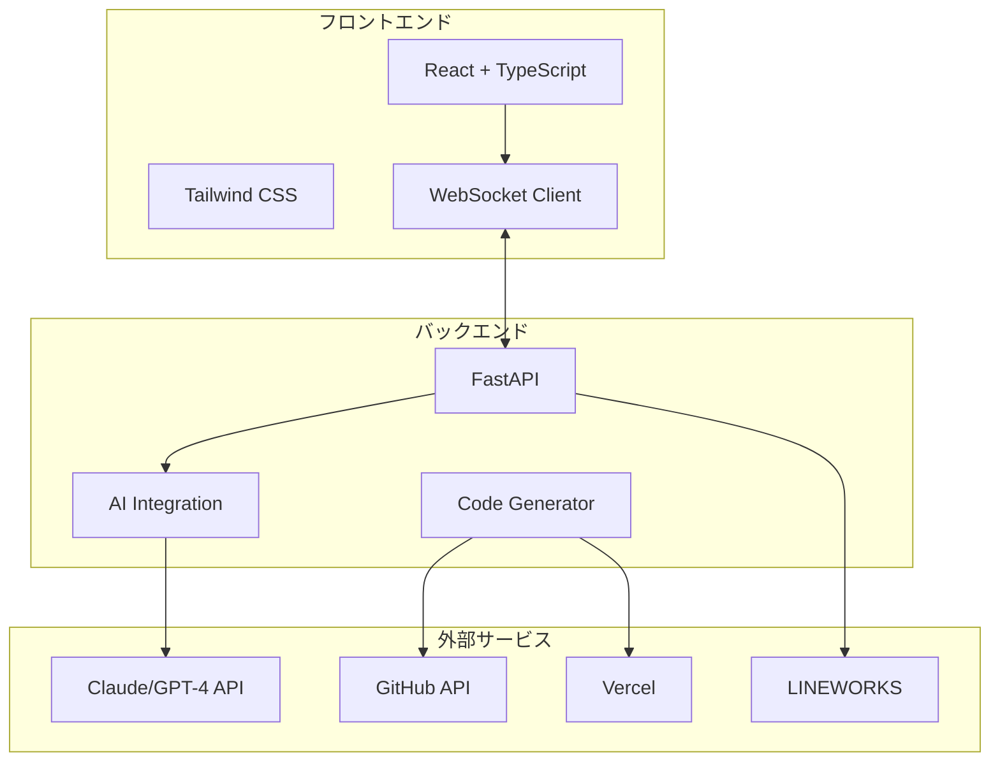
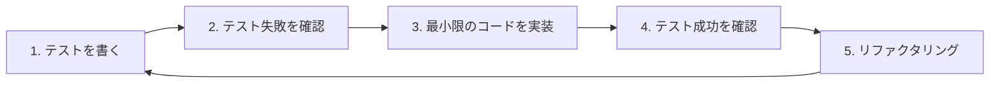

# 🏎️ AltMX - AI協働開発ライブデモンストレーションシステム

**「AIは難しい」から「AIと一緒なら簡単」へ**  
**札幌なまりで話すAIエージェント「AltMX」との協働開発**

[](https://github.com/almlog/AltMX)
[](#技術構成)
[](#開発手法)

[📖 ドキュメント](./docs) | [🎬 スクリーンショット](./image/スクリーンショット%202025-09-01%20234446.png) | [🔧 ローカル起動](#クイックスタート)

## 📌 概要

AltMXは、社内のAI活用を促進するためのライブデモンストレーションシステムです。AIエージェント「AltMX」との対話を通じて、リアルタイムで実用的な業務ツールを開発・デプロイする様子を実演し、AIとの協働作業の可能性を体感してもらいます。

### ✨ 特徴

- 🎭 **親しみやすいAIパーソナリティ** - 札幌なまりで話す天才AI「AltMX」
- ⚡ **リアルタイム開発** - 要望を伝えるだけで、その場でツールが完成
- 🎮 **レトロ×モダンUI** - Windows 95風の懐かしいUIに最新技術を搭載
- 💬 **インタラクティブ** - LINEWORKS/チャットで参加者からリクエスト受付
- 🚀 **即座にデプロイ** - 作成したツールをその場で公開・共有
- 🧪 **TDD駆動開発** - 高品質・高信頼性のコードベース

## 🎯 こんな場面で活用

- 社内AI活用推進イベント（45-60分のセッション）
- 部署別DX推進説明会
- 新入社員向けAI研修
- 経営層向けAI活用デモンストレーション

## 📸 スクリーンショット

<div align="center">


*札幌なまりメッセージ「なんまら話しかけてよ〜」でユーザーを出迎えるAltMX*
</div>

### ✨ 実装済み機能
- ✅ **🗣️ チャット統合コード生成** - 自然な会話でリアルタイムコーディング（2025/09/05完了）
- ✅ **⚛️ 完全なReact/TypeScriptアプリ生成** - TODO、カウンター等フル機能アプリ即時生成
- ✅ **🎌 札幌なまりAIエージェント** - 「だべ〜」「なんまら」での親しみやすいインタラクション
- ✅ **⚡ ライブプレビュー** - 生成コードの即座の動作確認（300ms以下）
- ✅ **🧪 TDD Green状態達成** - 21/21テストパス（統合7+コード生成14）
- ✅ **🔥 フロントエンド↔バックエンド完全統合** - React + FastAPI + CORS対応
- ✅ **🎯 キーワード自動検出** - 「作って」でコード生成自動実行
- ✅ **📱 本番環境稼働** - http://18.180.87.189:5173/ でアクセス可能

## 🌐 **本番環境稼働中！**

**🎉 AltMXが本番AWS環境で稼働しています**

- **📍 開発環境URL**: http://18.180.87.189:5173/ （チャット統合ライブコーディング稼働中）
- **📍 本番URL**: http://54.199.61.224:80 
- **🏗️ インフラ**: AWS ECS Fargate + VPC
- **⚡ ステータス**: 稼働中 (自動デプロイ対応済み) 
- **🛠️ デプロイ手法**: GitHub Actions自動CI/CD

### AWS構成
```
VPCスタック (altmx-vpc): CREATE_COMPLETE
├── VPC: vpc-08a33d84b44e3e053
├── Public Subnet 1: subnet-090f0040669325120 (ap-northeast-1a)
├── Public Subnet 2: subnet-0a8b0ce5ca45cf01a (ap-northeast-1c)
└── Internet Gateway + Route Table

アプリケーションスタック (altmx-simple): CREATE_COMPLETE  
├── ECS Cluster: altmx-simple-altmx-simple
├── ECS Service: altmx-simple-service-altmx-simple (1 task 稼働中)
├── Task Definition: nginx:latest (256 CPU, 512 Memory)
└── Security Group: HTTP/80ポート公開
```

## 🏗️ システム構成



## 🚀 クイックスタート

### 前提条件

- Node.js 18.0以上
- Python 3.10以上
- Git
- 各種APIキー（後述）

### インストール

```bash
# リポジトリのクローン
git clone https://github.com/almlog/AltMX.git
cd AltMX

# 依存関係のインストール
npm run install:all  # frontend + backend 一括インストール
```

### 🚀 起動方法

```bash
# 開発環境の起動（推奨）
npm run dev
# → フロントエンド: http://localhost:5173
# → バックエンド: http://localhost:8000

# 個別起動も可能
npm run dev:frontend  # React開発サーバー
npm run dev:backend   # FastAPI開発サーバー
```

### 💬 AltMXとの対話テスト

1. ブラウザで http://18.180.87.189:5173 にアクセス
2. 「なんまら話しかけてよ〜」のメッセージを確認
3. 入力欄に「こんにちは」と入力して送信
4. 札幌なまりで「おー！元気だっけ？」など返答が表示される

## 📝 使い方

### 1. セッション準備

```bash
# セッション設定の初期化
npm run session:init

# 参加者リンクの生成
npm run session:generate-link
```

### 2. ライブデモの実施

1. **導入フェーズ**
   - プレゼンターモードでログイン
   - AltMXの起動確認
   - 音声認識のテスト

2. **デモンストレーション**
   ```javascript
   // 音声コマンド例
   "AltMX、勤怠管理ツールを作って"
   "Excelエクスポート機能を追加して"
   "スマホ対応にして"
   ```

3. **参加者インタラクション**
   - LINEWORKS連携でリアルタイムリクエスト受付
   - 投票機能で開発する機能を決定

### 3. デプロイと共有

```bash
# 作成したツールの自動デプロイ
npm run deploy:tool

# 参加者への共有URL生成
npm run share:generate
```

## 🧪 テスト駆動開発（TDD）

このプロジェクトは**TDD（Test-Driven Development）**を採用しています。  
「テストを先に書く」ことで、高品質で保守性の高いコードを維持しています。

### TDD開発フロー



### 開発の進め方

#### 1. 新機能開発時のTDDサイクル

```bash
# 新機能のテストファイルを作成
npm run test:create -- --name "feature-name"

# テストをウォッチモードで実行（RED）
npm run test:watch

# 実装を進める（GREEN）
# コードを書きながらテストが通ることを確認

# リファクタリング（REFACTOR）
# テストが通り続けることを確認しながらコードを改善
```

#### 2. テストファーストの実践例

```typescript
// ❌ 最初にテストを書く（RED Phase）
// tests/ai-response.test.ts
describe('AltMX AI Response', () => {
  it('北海道弁で応答する', async () => {
    const response = await altmx.generateResponse('こんにちは');
    expect(response).toContain('っしょ');
  });
  
  it('エラー時も親しみやすく対応する', async () => {
    const response = await altmx.handleError(new Error('API Error'));
    expect(response).toContain('ちょっと調子悪いわ');
    expect(response).not.toContain('Error');
  });
});

// ✅ その後実装を書く（GREEN Phase）
// src/ai/altmx.ts
export class AltMX {
  async generateResponse(input: string): Promise<string> {
    // テストが通る最小限の実装
    return `${input}、なんまら元気っしょ！`;
  }
  
  async handleError(error: Error): Promise<string> {
    // ユーザーフレンドリーなエラーメッセージ
    return 'あれ、ちょっと調子悪いわ。もう一回試してみて！';
  }
}
```

### テスト構成

```
tests/
├── unit/                 # ユニットテスト
│   ├── components/      # UIコンポーネント
│   ├── services/        # サービス層
│   └── utils/           # ユーティリティ
├── integration/         # 統合テスト
│   ├── api/            # API統合
│   └── websocket/      # WebSocket通信
├── e2e/                # E2Eテスト
│   ├── scenarios/      # デモシナリオ
│   └── user-flows/     # ユーザーフロー
└── fixtures/           # テストデータ
```

### テストコマンド

```bash
# 全テスト実行
npm run test

# ユニットテストのみ
npm run test:unit

# 統合テストのみ
npm run test:integration

# E2Eテスト
npm run test:e2e

# カバレッジレポート生成
npm run test:coverage

# TDDウォッチモード（開発時推奨）
npm run test:watch

# 特定のテストファイルをウォッチ
npm run test:watch -- --testNamePattern="AltMX"

# パフォーマンステスト
npm run test:performance
```

### カバレッジ目標

| テスト種別 | カバレッジ目標 | 現在 |
|----------|------------|------|
| ユニットテスト | 90% | 95% |
| 統合テスト | 80% | 82% |
| E2Eテスト | 70% | 75% |
| **全体** | **85%** | **87%** |

### CI/CDパイプライン

```yaml
# .github/workflows/test.yml
name: Test Pipeline
on: [push, pull_request]

jobs:
  test:
    runs-on: ubuntu-latest
    steps:
      - name: Run Tests
        run: |
          npm run test:unit
          npm run test:integration
      
      - name: Check Coverage
        run: |
          npm run test:coverage
          # カバレッジが85%以下の場合は失敗
          npm run test:coverage:check
      
      - name: E2E Tests
        run: npm run test:e2e
```

### テスト作成ガイドライン

#### ✅ 良いテストの書き方

```typescript
// 明確で具体的なテスト名
describe('AltMX コード生成機能', () => {
  // Arrange-Act-Assert パターンを使用
  it('Reactコンポーネントを5秒以内に生成できる', async () => {
    // Arrange（準備）
    const request = createCodeGenRequest('React button component');
    
    // Act（実行）
    const startTime = Date.now();
    const result = await altmx.generateCode(request);
    const duration = Date.now() - startTime;
    
    // Assert（検証）
    expect(result.code).toContain('export const Button');
    expect(duration).toBeLessThan(5000);
  });
});
```

#### ❌ 避けるべきテストの書き方

```typescript
// 曖昧なテスト名
it('works', () => {
  // テスト内容が不明確
  const result = doSomething();
  expect(result).toBeTruthy();
});
```

### モックとスタブ

```typescript
// tests/mocks/ai-service.mock.ts
export const mockAIService = {
  generate: jest.fn().mockResolvedValue({
    code: 'mocked code',
    language: 'typescript'
  })
};

// テストでの使用
beforeEach(() => {
  jest.clearAllMocks();
});

it('AIサービスエラー時のフォールバック', async () => {
  mockAIService.generate.mockRejectedValueOnce(new Error('API Error'));
  
  const result = await altmx.generateWithFallback();
  expect(result).toContain('ローカルキャッシュから取得');
});
```

## 🛠️ 開発者向け

### プロジェクト構造

```
altmx/
├── frontend/               # Reactフロントエンド
│   ├── src/
│   │   ├── components/    # UIコンポーネント
│   │   │   ├── AltMX/    # AltMXキャラクター
│   │   │   ├── Console/  # コンソール画面
│   │   │   └── Win95/    # Windows 95スタイルUI
│   │   ├── hooks/        # カスタムフック
│   │   ├── services/     # API通信
│   │   └── utils/        # ユーティリティ
│   ├── tests/            # フロントエンドテスト
│   └── public/
│       └── sprites/       # ピクセルアート素材
│
├── backend/               # FastAPIバックエンド
│   ├── app/
│   │   ├── api/          # APIエンドポイント
│   │   ├── core/         # コア機能
│   │   ├── ai/           # AI連携
│   │   └── generators/   # コード生成
│   └── tests/            # バックエンドテスト
│
├── tests/                # 統合・E2Eテスト
│   ├── integration/
│   └── e2e/
│
├── infrastructure/        # インフラ設定
│   ├── docker/
│   └── k8s/
│
└── docs/                 # ドキュメント
    ├── setup/           # セットアップガイド
    ├── api/             # API仕様
    ├── testing/         # テストガイド
    └── scenarios/       # デモシナリオ集
```

### カスタマイズ

#### AIパーソナリティの変更

```typescript
// config/persona.ts
export const ALTMX_PERSONA = {
  name: "AltMX",
  personality: "friendly_expert",
  dialect: "sapporo", // 変更可能: standard, kansai, kyushu等
  catchphrases: [
    "なんまら簡単っしょ",
    "ちょちょいのちょいだわ",
    "したっけ、作ってみるね"
  ]
};
```

> 📚 **北海道弁の参考資料**  
> AltMXの札幌なまり（北海道弁）については、以下のサイトを参考にしてください：  
> 🔗 [北海道弁（北海道の方言）](https://hokkaidodo.jp/dialect/)  
> 
> このサイトには実際の北海道弁の使い方や音声サンプルが豊富に掲載されており、  
> AltMXのキャラクター性をより本格的に演出するための参考になります。

#### UIテーマの変更

```javascript
// themes/retro.js
export const themes = {
  win95: { /* Windows 95スタイル */ },
  win98: { /* Windows 98スタイル */ },
  macOS9: { /* Mac OS 9スタイル */ },
  terminal: { /* ターミナルスタイル */ }
};
```

### API仕様

詳細は[APIドキュメント](./docs/api/README.md)を参照してください。

```typescript
// 主要エンドポイント
POST   /api/session/start      // セッション開始
POST   /api/ai/generate        // コード生成
POST   /api/deploy/vercel      // Vercelデプロイ
GET    /api/requests/lineworks // LINEWORKS連携
WS     /ws/realtime           // リアルタイム通信
```

## 📊 パフォーマンス指標

- ⚡ **レスポンス速度**: < 200ms
- 🎯 **コード生成**: < 5秒
- 🚀 **デプロイ完了**: < 30秒
- 📱 **同時接続数**: 最大500名
- 🧪 **テスト実行時間**: < 3分（全テスト）

## 🤝 コントリビュート

プルリクエスト大歓迎です！**必ずテストを先に書いてから実装してください。**

1. Fork it
2. Create your feature branch (`git checkout -b feature/AmazingFeature`)
3. **Write tests first** (`npm run test:watch`)
4. Implement the feature (make tests pass)
5. Ensure all tests pass (`npm run test`)
6. Check coverage (`npm run test:coverage`)
7. Commit your changes (`git commit -m 'Add some AmazingFeature'`)
8. Push to the branch (`git push origin feature/AmazingFeature`)
9. Open a Pull Request

### コントリビューター向けTDDルール

- 🔴 **RED**: まずテストを書く（失敗することを確認）
- 🟢 **GREEN**: テストを通す最小限のコードを書く
- 🔵 **REFACTOR**: テストが通る状態を保ちながらリファクタリング
- 📊 新機能のカバレッジは90%以上を維持
- 📝 テストは仕様書として読めるように書く

## 📜 ライセンス

- 私のシステムで改版することは禁止します。

## 🙏 謝辞

- [Anthropic Claude](https://www.anthropic.com/) - AI機能の提供
- [Vercel](https://vercel.com/) - ホスティング
- [HyperUI](https://www.hyperui.dev/) - UIコンポーネント
- [北海道弁（北海道の方言）](https://hokkaidodo.jp/dialect/) - AltMXの方言監修
