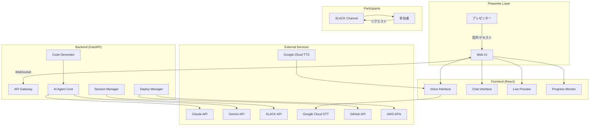
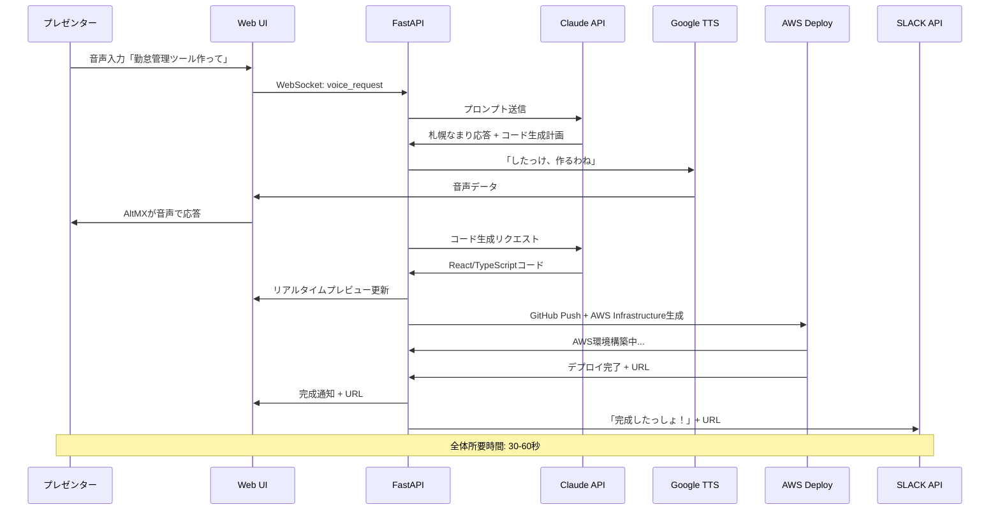
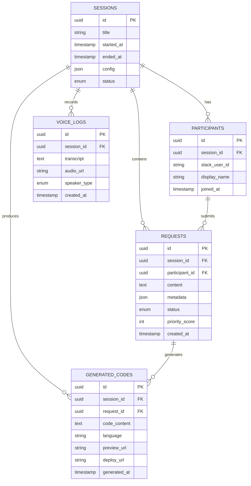
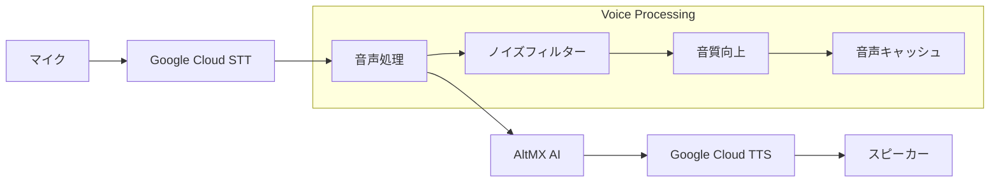
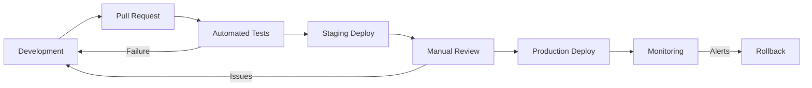

# AltMX Technical Design Document

## Project Information
**Project Name**: AltMX (Alternative Model X)  
**Version**: 1.0  
**Date**: 2025-09-01  
**Author**: AI Engineer "ANO" & SHUNPEI  
**Review Status**: Draft

## Table of Contents
1. [Overview](#overview)
2. [Architecture](#architecture)
3. [Technology Stack](#technology-stack)
4. [System Design](#system-design)
5. [Database Design](#database-design)
6. [API Design](#api-design)
7. [Voice System Design](#voice-system-design)
8. [Security Design](#security-design)
9. [Performance Considerations](#performance-considerations)
10. [Deployment Architecture](#deployment-architecture)
11. [Testing Strategy](#testing-strategy)

## Overview
### Purpose
AltMXは社内AI活用を促進するライブデモンストレーションシステムの技術設計書。AIエージェント「AltMX」が札幌なまりで話しながら、リアルタイムでWebツールを開発・デプロイする様子を実演する。

### Scope
- フロントエンド: React + TypeScript + TailwindCSS
- バックエンド: FastAPI + Python
- AI統合: Claude API/Gemini API + 音声合成・認識
- 外部連携: SLACK API、コード生成・デプロイ自動化

### Design Principles
- **ライブデモ特化**: リアルタイム性とデモ演出を最優先
- **TDD重視**: テスト駆動開発でバグのないライブデモを保証
- **札幌なまり**: 親しみやすいAIキャラクターとしての一貫性
- **シンプル構成**: 複雑さを排除し、デモ失敗リスクを最小化

## Architecture
### High-Level Architecture



### Component Overview
#### Frontend Components
- **Voice Interface**: 音声入出力とAltMXアバター表示
- **Chat Interface**: テキストベースの対話ログ表示
- **Live Preview**: 生成されたコードのリアルタイムプレビュー
- **Progress Monitor**: 開発進捗とシステム状態の可視化
- **SLACK Integration**: 参加者リクエストの表示・管理

#### Backend Components
- **AI Agent Core**: AltMXの札幌なまり応答とロジック制御
- **Code Generator**: React/TypeScriptコード自動生成エンジン
- **Deploy Manager**: GitHub Push + AWS Infrastructure + 自動デプロイ
- **Session Manager**: デモセッション制御と参加者管理
- **Voice Processor**: TTS/STT処理と音声データ管理

#### External Dependencies
- **Claude API**: メインのAI推論エンジン
- **Gemini API**: フォールバック用AI推論エンジン
- **Google Cloud Speech**: TTS/STT処理
- **SLACK API**: 参加者インタラクション
- **GitHub API**: コード管理・自動プッシュ
- **AWS APIs**: インフラ自動構築・デプロイ（CloudFormation, ECS, etc.）

## Technology Stack
### Frontend
- **Framework**: React 18 + TypeScript 5.0
- **Styling**: TailwindCSS 3.4 + HeadlessUI
- **State Management**: Zustand (軽量・シンプル)
- **Real-time**: Socket.io Client
- **Voice**: Web Speech API (フォールバック) + Google Cloud Speech
- **Build Tools**: Vite 5.0 (高速開発・ビルド)
- **Testing**: Vitest + React Testing Library + Playwright (E2E)

### Backend  
- **Runtime**: Python 3.11
- **Framework**: FastAPI 0.104 + Uvicorn
- **Real-time**: Socket.io Python
- **AI Integration**: anthropic, google-generativeai ライブラリ
- **Voice Processing**: google-cloud-speech, pydub
- **Task Queue**: Celery + Redis (重い処理の非同期実行)
- **Testing**: pytest + httpx + pytest-asyncio

### Database & Storage
- **Primary DB**: Supabase (PostgreSQL 15)
- **Cache/Session**: Redis Cloud
- **File Storage**: Google Cloud Storage (音声ファイル、生成コード)
- **Real-time Features**: Supabase Realtime (WebSocket)

### DevOps & Infrastructure
- **Live Demo Deploy**: AWS (ECS, CloudFormation, ALB)
- **Backend Deploy**: AWS ECS または AWS Lambda
- **Infrastructure as Code**: AWS CloudFormation (AI生成)
- **CI/CD**: GitHub Actions + AWS CodePipeline
- **Monitoring**: AWS CloudWatch, Sentry (エラー監視)
- **CDN**: AWS CloudFront

## System Design
### Data Flow



### Request/Response Flow
1. **音声入力フロー**
   - プレゼンター音声 → Google Cloud STT → テキスト変換
   - WebSocket経由でリアルタイム送信
   - レスポンス生成後、TTS経由で音声返答

2. **コード生成フロー** 
   - 要求解析 → Claude APIでコード生成
   - 段階的生成（HTML構造 → CSS → JavaScript → API）
   - 各段階でプレビュー更新

3. **ライブデプロイフロー**
   - 生成コード → GitHub自動プッシュ
   - AWS CloudFormation自動生成・実行
   - ECS/ALB環境構築 → 自動デプロイ → URL生成
   - SLACK通知で参加者と共有

### State Management
- **Frontend**: Zustand store
  ```typescript
  interface AppState {
    session: SessionState;
    voice: VoiceState;
    chat: ChatState;
    codeGen: CodeGenState;
    participants: ParticipantState;
  }
  ```

- **Backend**: FastAPI Dependency Injection
  ```python
  @app.get("/api/session/status")
  async def get_session_status(
      session: SessionManager = Depends(get_session_manager),
      ai: AIAgent = Depends(get_ai_agent)
  ):
  ```

### Error Handling
- **段階的フォールバック**: Claude API → Gemini API → 事前準備済みレスポンス
- **デモ継続優先**: エラー時もAltMXが親しみやすく対応
- **リアルタイムリカバリ**: WebSocket再接続、状態復元

## Database Design
### Schema Overview
PostgreSQL (Supabase) を使用し、シンプルな正規化設計

### Entity Relationship Diagram


### Key Tables/Collections
#### Table 1: SESSIONS
```sql
CREATE TABLE sessions (
    id UUID PRIMARY KEY DEFAULT gen_random_uuid(),
    title VARCHAR(255) NOT NULL,
    started_at TIMESTAMP WITH TIME ZONE DEFAULT NOW(),
    ended_at TIMESTAMP WITH TIME ZONE,
    config JSONB DEFAULT '{}',
    status session_status DEFAULT 'active',
    created_at TIMESTAMP WITH TIME ZONE DEFAULT NOW()
);

CREATE TYPE session_status AS ENUM ('preparing', 'active', 'paused', 'completed', 'error');
```
- **Purpose**: デモセッションの管理
- **Key Relationships**: participants, requests, generated_codes
- **Indexes**: status, started_at

#### Table 2: REQUESTS  
```sql
CREATE TABLE requests (
    id UUID PRIMARY KEY DEFAULT gen_random_uuid(),
    session_id UUID REFERENCES sessions(id),
    participant_id UUID REFERENCES participants(id),
    content TEXT NOT NULL,
    metadata JSONB DEFAULT '{}',
    status request_status DEFAULT 'pending',
    priority_score INTEGER DEFAULT 0,
    created_at TIMESTAMP WITH TIME ZONE DEFAULT NOW()
);

CREATE TYPE request_status AS ENUM ('pending', 'processing', 'completed', 'rejected');
CREATE INDEX idx_requests_session_status ON requests(session_id, status);
CREATE INDEX idx_requests_priority ON requests(priority_score DESC, created_at);
```
- **Purpose**: 参加者からのリクエスト管理
- **Key Relationships**: sessions, participants, generated_codes
- **Indexes**: session_id + status, priority_score

### Data Migration Strategy
- **Supabase Migrations**: SQLファイルベースの段階的マイグレーション
- **Seed Data**: デモ用のサンプルセッション、リクエストデータ
- **Backup Strategy**: 毎日自動バックアップ + セッション前の手動バックアップ

## API Design
### RESTful Endpoints
#### Session Management
- `POST /api/sessions` - 新規セッション作成
- `GET /api/sessions/{session_id}` - セッション情報取得
- `PATCH /api/sessions/{session_id}` - セッション状態更新
- `DELETE /api/sessions/{session_id}` - セッション終了

#### AI Interaction
- `POST /api/ai/chat` - テキストチャット
- `POST /api/ai/voice` - 音声処理（STT+TTS）
- `POST /api/ai/code-gen` - コード生成リクエスト
- `GET /api/ai/code-gen/{task_id}/status` - 生成ステータス

#### SLACK Integration
- `POST /api/slack/webhook` - SLACK Webhook受信
- `GET /api/slack/requests/{session_id}` - セッション別リクエスト取得
- `POST /api/slack/notify` - SLACK通知送信

#### Live Deployment & Infrastructure
- `POST /api/deploy/github` - GitHub自動コミット・プッシュ
- `POST /api/deploy/aws-infrastructure` - AWS環境自動構築
- `POST /api/deploy/aws-deploy` - AWSへの自動デプロイ
- `GET /api/deploy/{deploy_id}/status` - デプロイ・インフラ構築状況
- `GET /api/deploy/{deploy_id}/url` - 完成したWebシステムURL

### WebSocket Events
```typescript
// Client → Server
interface ClientEvents {
  'session:join': { sessionId: string; userInfo: UserInfo };
  'voice:start': { sessionId: string };
  'voice:data': { audioData: ArrayBuffer };
  'voice:end': {};
  'chat:message': { content: string };
  'request:submit': { content: string; priority: number };
}

// Server → Client  
interface ServerEvents {
  'session:status': { status: SessionStatus };
  'altmx:response': { text: string; audioUrl?: string };
  'code:preview': { code: string; language: string };
  'deploy:status': { status: DeployStatus; url?: string };
  'participant:joined': { participant: Participant };
  'request:received': { request: Request };
}
```

### API Documentation
OpenAPI 3.0仕様で自動生成、FastAPI標準機能

```python
@app.post("/api/ai/chat", response_model=AIResponse)
async def ai_chat(
    request: ChatRequest,
    session: SessionManager = Depends(get_session_manager)
) -> AIResponse:
    """
    AltMXとのテキストチャット
    
    - **request**: チャットリクエスト内容
    - **returns**: 札幌なまりでの応答テキスト + メタデータ
    """
```

### Request/Response Formats
```json
// ChatRequest
{
  "sessionId": "uuid",
  "message": "勤怠管理ツール作って",
  "context": {
    "previousRequests": [],
    "currentTask": null
  }
}

// AIResponse  
{
  "success": true,
  "data": {
    "text": "したっけ、勤怠管理ツール作るわね！",
    "audioUrl": "https://storage.googleapis.com/altmx-audio/response-123.mp3",
    "metadata": {
      "dialect": "sapporo",
      "emotion": "enthusiastic",
      "nextAction": "code_generation"
    }
  },
  "timing": {
    "processingTime": 1.2,
    "ttsTime": 0.8
  }
}
```

## Voice System Design
### Architecture Overview


### Speech-to-Text (STT)
- **Primary**: Google Cloud Speech-to-Text API
  - 日本語音声認識特化
  - リアルタイムストリーミング対応
  - ノイズキャンセリング機能

- **Fallback**: Web Speech API
  - ネットワーク障害時の緊急対応
  - ブラウザネイティブ機能

```python
class STTProcessor:
    async def process_audio_stream(
        self, 
        audio_stream: AsyncGenerator[bytes, None]
    ) -> AsyncGenerator[str, None]:
        """リアルタイム音声認識"""
        client = speech.SpeechClient()
        config = speech.RecognitionConfig(
            encoding=speech.RecognitionConfig.AudioEncoding.WEBM_OPUS,
            sample_rate_hertz=48000,
            language_code="ja-JP",
            enable_automatic_punctuation=True,
            model="latest_long"  # 長時間音声対応
        )
        
        async for transcript in client.streaming_recognize(config, audio_stream):
            if transcript.is_final:
                yield transcript.alternatives[0].transcript
```

### Text-to-Speech (TTS)
- **Primary**: Google Cloud Text-to-Speech API
  - 日本語女性音声（Neural2-B）使用
  - SSML対応で札幌なまりのイントネーション調整
  - 感情表現対応

```python
class TTSProcessor:
    def __init__(self):
        self.voice_config = tts.VoiceSelectionParams(
            language_code="ja-JP",
            name="ja-JP-Neural2-B",  # 自然な女性音声
            ssml_gender=tts.SsmlVoiceGender.FEMALE
        )
        
    async def synthesize_sapporo_dialect(self, text: str) -> bytes:
        """札幌なまり音声合成"""
        # SSML for 札幌なまり調整
        ssml_text = f"""
        <speak>
            <prosody rate="0.9" pitch="+2st">
                {self._convert_to_sapporo_dialect(text)}
            </prosody>
        </speak>
        """
        
        audio_config = tts.AudioConfig(
            audio_encoding=tts.AudioEncoding.MP3,
            speaking_rate=0.9,  # ゆっくり親しみやすく
            pitch=2.0  # 少し高めのトーン
        )
        
        response = await self.client.synthesize_speech(
            input=tts.SynthesisInput(ssml=ssml_text),
            voice=self.voice_config,
            audio_config=audio_config
        )
        
        return response.audio_content
        
    def _convert_to_sapporo_dialect(self, text: str) -> str:
        """標準語を札幌なまりに変換"""
        dialect_map = {
            "ですね": "だっしょ",
            "とても": "なんまら", 
            "そうですね": "したっけそうだね",
            "できます": "できるっしょ",
            "わかりました": "わかったわ"
        }
        
        for standard, dialect in dialect_map.items():
            text = text.replace(standard, dialect)
        return text
```

### Voice Processing Pipeline
1. **Audio Capture**: 48kHz WebM Opus format
2. **Noise Reduction**: Background noise filtering
3. **STT Processing**: Real-time transcription
4. **AI Processing**: Response generation
5. **TTS Synthesis**: Sapporo-dialect audio generation
6. **Audio Streaming**: Chunked delivery for low latency

### Performance Optimization
- **Audio Caching**: 頻出応答の事前生成音声キャッシュ
- **Streaming**: チャンクベースの音声ストリーミング
- **Quality Adjustment**: ネットワーク状況に応じた品質調整

## Security Design
### Authentication Strategy
- **Presenter Authentication**: Google OAuth 2.0
- **Session Access Control**: UUID-based session keys
- **Participant Authentication**: SLACK OAuth (optional)

### Authorization Strategy
- **Role-Based Access**: Presenter / Participant / Viewer
- **Session-Scoped Permissions**: セッション内での操作制限
- **API Rate Limiting**: DDoS防止、リソース保護

### Data Protection
- **Encryption at Rest**: Supabase標準暗号化 (AES-256)
- **Encryption in Transit**: TLS 1.3 (HTTPS/WSS)
- **Sensitive Data Handling**: 
  - API Key: 環境変数 + Vercel Secrets
  - Audio Data: 24時間後自動削除
  - Chat Logs: 匿名化オプション

### Security Headers
```typescript
// Next.js Security Headers
const securityHeaders = [
  {
    key: 'X-DNS-Prefetch-Control',
    value: 'on'
  },
  {
    key: 'Strict-Transport-Security',
    value: 'max-age=63072000; includeSubDomains; preload'
  },
  {
    key: 'X-Frame-Options',
    value: 'SAMEORIGIN'
  },
  {
    key: 'Content-Security-Policy',
    value: ContentSecurityPolicy.replace(/\s{2,}/g, ' ').trim()
  }
]
```

### Input Validation
- **API Input Sanitization**: Pydantic models
- **Audio Data Validation**: Format/size/duration checks  
- **SLACK Message Filtering**: 不適切コンテンツ検出

```python
class ChatRequest(BaseModel):
    sessionId: UUID
    message: str = Field(..., min_length=1, max_length=1000)
    context: Optional[Dict[str, Any]] = None
    
    @validator('message')
    def sanitize_message(cls, v):
        # HTML/Script injection prevention
        return html.escape(v.strip())
```

## Performance Considerations
### Frontend Performance
- **Code Splitting**: Route-based dynamic imports
- **Lazy Loading**: コンポーネントの遅延読み込み
- **Caching Strategy**: 
  - Service Worker: Static assets
  - IndexedDB: Voice data
  - Memory: UI state

```typescript
// React.lazy for code splitting
const VoiceInterface = lazy(() => import('./components/VoiceInterface'));
const ChatInterface = lazy(() => import('./components/ChatInterface'));

// Service Worker caching
const CACHE_NAME = 'altmx-v1';
const urlsToCache = [
  '/static/js/bundle.js',
  '/static/css/main.css',
  '/audio/startup.mp3'
];
```

### Backend Performance
- **Database Optimization**: 
  - Connection pooling (10-20 connections)
  - Query optimization (EXPLAIN ANALYZE)
  - Read replicas for analytics

- **Caching Strategy**:
  - Redis: Session data, AI response cache
  - CDN: Static assets, audio files
  - Application: In-memory frequent data

```python
# Redis caching decorator
from functools import wraps
import redis

redis_client = redis.Redis(host='redis-url', port=6379, db=0)

def cache_result(expiration: int = 3600):
    def decorator(func):
        @wraps(func)
        async def wrapper(*args, **kwargs):
            cache_key = f"{func.__name__}:{hash(str(args) + str(kwargs))}"
            cached = redis_client.get(cache_key)
            if cached:
                return json.loads(cached)
            
            result = await func(*args, **kwargs)
            redis_client.setex(cache_key, expiration, json.dumps(result))
            return result
        return wrapper
    return decorator

@cache_result(expiration=1800)  # 30分キャッシュ
async def generate_code_response(request: str) -> dict:
    # 時間のかかるAI処理
    pass
```

### Scalability Plan
- **Horizontal Scaling**: 
  - Frontend: Vercel Edge Functions
  - Backend: Google Cloud Run (auto-scaling)
  - Database: Supabase (managed scaling)

- **Load Balancing**: 
  - WebSocket connections: Sticky sessions
  - AI API calls: Circuit breaker pattern
  - File storage: CDN distribution

- **Monitoring & Alerting**:
  - Response time: < 2sec (99th percentile)
  - Error rate: < 1%
  - Uptime: 99.9%

## Deployment Architecture
### Environment Setup
#### Development Environment
- **Local**: Docker Compose + Hot reload
- **Database**: Local PostgreSQL + Redis
- **Services**: Mock APIs for external services

#### Staging Environment  
- **Frontend**: Vercel Preview Deploys
- **Backend**: Railway Staging
- **Database**: Supabase Staging Project
- **Services**: Sandbox APIs (限定機能)

#### Production Environment
- **Frontend**: Vercel Production
- **Backend**: Google Cloud Run
- **Database**: Supabase Production
- **Services**: Production APIs (full feature)

### Deployment Process


1. **Development → Staging**
   - GitHub Actions trigger
   - Tests (unit/integration/e2e)
   - Staging deployment
   - Smoke testing

2. **Staging → Production**
   - Manual approval
   - Blue-green deployment  
   - Health checks
   - Traffic gradual shift

3. **Rollback Strategy**
   - Immediate: Previous Vercel deployment
   - Database: Point-in-time recovery
   - Cache: Invalidation + rebuild

### Monitoring and Alerts
- **Application Monitoring**: Sentry error tracking
- **Performance**: Google Cloud Monitoring
- **Uptime**: Status page (public)
- **Business Metrics**: Session success rate, user engagement

```python
# Health check endpoint
@app.get("/health")
async def health_check():
    checks = {
        'database': await check_database(),
        'redis': await check_redis(), 
        'ai_api': await check_claude_api(),
        'voice_api': await check_google_speech()
    }
    
    all_healthy = all(checks.values())
    status_code = 200 if all_healthy else 503
    
    return JSONResponse(
        status_code=status_code,
        content={'status': 'healthy' if all_healthy else 'unhealthy', 'checks': checks}
    )
```

## Testing Strategy
### Unit Testing
- **Coverage Target**: 90%+ (critical paths 100%)
- **Frontend**: Vitest + React Testing Library
- **Backend**: pytest + httpx + pytest-asyncio

```typescript
// Frontend Unit Test Example
import { render, screen, fireEvent } from '@testing-library/react';
import { describe, it, expect, vi } from 'vitest';
import VoiceInterface from './VoiceInterface';

describe('VoiceInterface', () => {
  it('AltMXが札幌なまりで応答する', async () => {
    const mockTTS = vi.fn();
    render(<VoiceInterface onTTS={mockTTS} />);
    
    fireEvent.click(screen.getByText('話す'));
    
    await waitFor(() => {
      expect(mockTTS).toHaveBeenCalledWith(
        expect.stringContaining('っしょ')
      );
    });
  });
});
```

```python
# Backend Unit Test Example
import pytest
from app.ai.altmx import AltMXAgent

@pytest.mark.asyncio
async def test_altmx_sapporo_dialect():
    agent = AltMXAgent()
    
    response = await agent.generate_response("こんにちは")
    
    # 札幌なまりの確認
    assert any(word in response for word in ["っしょ", "だっしょ", "なんまら"])
    # 親しみやすさの確認
    assert not any(word in response for word in ["です・ます調", "システム"])
```

### Integration Testing
- **API Integration**: FastAPI TestClient
- **WebSocket Testing**: Real-time communication tests
- **External Service Mocking**: AI API、Voice API

### End-to-End Testing
- **Framework**: Playwright
- **Scenarios**: 実際のデモシナリオに基づく
- **Environment**: Staging環境で実行

```typescript
// E2E Test Example  
import { test, expect } from '@playwright/test';

test('Complete demo session flow', async ({ page }) => {
  // セッション開始
  await page.goto('/session/new');
  await page.click('[data-testid="start-session"]');
  
  // 音声入力シミュレーション
  await page.click('[data-testid="voice-button"]');
  await page.fill('[data-testid="text-input"]', 'タスク管理ツール作って');
  await page.click('[data-testid="send"]');
  
  // AltMX応答確認  
  await expect(page.locator('[data-testid="altmx-response"]'))
    .toContainText('したっけ');
  
  // コード生成確認
  await expect(page.locator('[data-testid="code-preview"]'))
    .toBeVisible();
    
  // デプロイURL生成確認
  await expect(page.locator('[data-testid="deploy-url"]'))
    .toContainText('https://');
    
  // 所要時間確認（60秒以内）
  await expect(page.locator('[data-testid="completion-time"]'))
    .toContainText(/[0-5][0-9]秒/);
});
```

### Performance Testing
- **Load Testing**: Artillery.io
- **Voice Processing**: 音声遅延測定
- **Real-time Communication**: WebSocket負荷テスト

### Testing in CI/CD
```yaml
# .github/workflows/test.yml
name: Test Pipeline
on: [push, pull_request]

jobs:
  test:
    runs-on: ubuntu-latest
    steps:
      - uses: actions/checkout@v4
      
      - name: Setup Node.js
        uses: actions/setup-node@v4
        with:
          node-version: '18'
          
      - name: Setup Python  
        uses: actions/setup-python@v4
        with:
          python-version: '3.11'
          
      - name: Install Dependencies
        run: |
          npm ci
          pip install -r requirements.txt
          
      - name: Unit Tests
        run: |
          npm run test:unit
          pytest tests/unit/
          
      - name: Integration Tests
        run: |
          npm run test:integration  
          pytest tests/integration/
          
      - name: E2E Tests
        run: |
          npx playwright install
          npm run test:e2e
          
      - name: Performance Tests
        run: |
          npm run test:performance
```

## Risk Mitigation
### Technical Risks
- **AI API障害**: 
  - Circuit breaker pattern
  - 複数プロバイダー対応（Claude + Gemini）
  - 事前準備済み応答キャッシュ

- **リアルタイム処理遅延**: 
  - WebSocket connection pooling
  - 段階的応答（immediate ACK + progressive updates）
  - Quality of Service優先制御

```python
# Circuit Breaker Implementation
from circuit_breaker import CircuitBreaker

class AIService:
    def __init__(self):
        self.claude_breaker = CircuitBreaker(
            failure_threshold=5,
            recovery_timeout=30,
            expected_exception=APIException
        )
        self.gemini_breaker = CircuitBreaker(
            failure_threshold=3, 
            recovery_timeout=20
        )
    
    @circuit_breaker.claude_breaker
    async def call_claude_api(self, prompt: str) -> str:
        # Claude API call
        pass
        
    async def generate_with_fallback(self, prompt: str) -> str:
        try:
            return await self.call_claude_api(prompt)
        except CircuitBreakerOpen:
            return await self.call_gemini_api(prompt)  # Fallback
        except Exception:
            return self.get_cached_response(prompt)  # Emergency fallback
```

### Operational Risks
- **デモ中断**: 
  - Health check monitoring
  - Auto-recovery mechanisms
  - Manual override controls

- **参加者過多**:
  - Rate limiting per participant
  - Queue management for requests
  - Graceful degradation

## Future Considerations
### Phase 2 Enhancements
- **Advanced Voice**: 感情表現・間の取り方の向上
- **Multi-Language**: 英語対応
- **Enhanced Analytics**: セッション分析ダッシュボード

### Technical Debt
- **初期実装での簡略化箇所**:
  - Error handling の詳細化
  - Test coverage の100%化
  - Performance optimization の深度化

### Scalability Roadmap  
- **Enterprise Features**: Multi-tenant対応
- **Advanced AI**: Fine-tuned models
- **Platform Expansion**: Mobile app、Desktop app

## Appendices
### Glossary
- **AltMX**: AI Agent with Sapporo dialect personality
- **札幌なまり**: Sapporo dialect (Hokkaido region)
- **TDD**: Test-Driven Development methodology
- **STT**: Speech-to-Text conversion
- **TTS**: Text-to-Speech synthesis

### References
- [FastAPI Documentation](https://fastapi.tiangolo.com/)
- [React 18 Documentation](https://react.dev/)
- [Google Cloud Speech API](https://cloud.google.com/speech-to-text)
- [Supabase Documentation](https://supabase.com/docs)
- [Vercel Platform](https://vercel.com/docs)